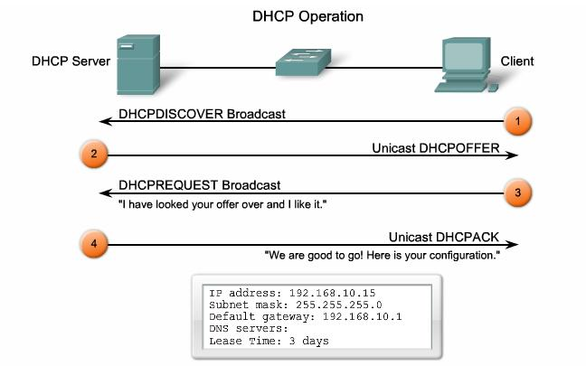
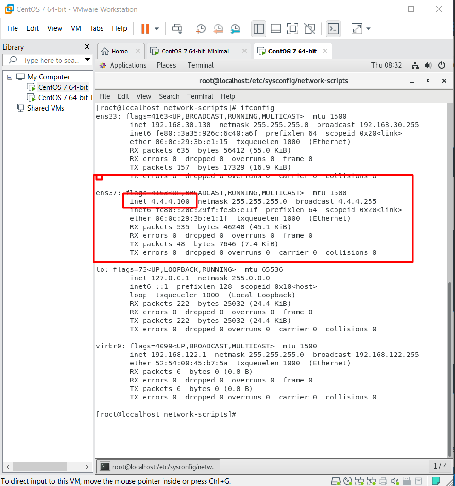
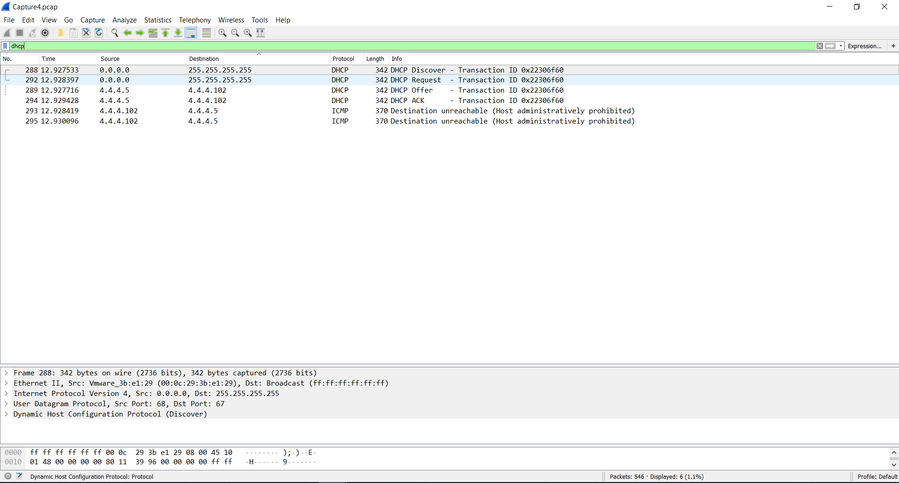

# DHCP  
Dynamic Host Configuration Protocol (DHCP - giao thức cấu hình động máy chủ) là một giao thức cho phép cấp phát địa chỉ IP một cách tự động cùng với các cấu hình liên quan khác như subnet mask và gateway mặc định. Máy tính được cấu hình một cách tự động vì thế sẽ giảm việc can thiệp vào hệ thống mạng. Nó cung cấp một database trung tâm để theo dõi tất cả các máy tính trong hệ thống mạng. Mục đích quan trọng nhất là tránh trường hợp hai máy tính khác nhau lại có cùng địa chỉ IP.

Nếu không có DHCP, các máy có thể cấu hình IP thủ công (cấu hình IP tĩnh). Ngoài việc cung cấp địa chỉ IP, DHCP còn cung cấp thông tin cấu hình khác, cụ thể như DNS. Hiện nay DHCP có 2 version: cho IPv4 và IPv6. 

## Kiến trúc DHCP

- Có 3 thành phần bên trong kiến trúc DHCP bao gồm DHCP client, DHCP server, và DHCP relay agents.

  - DHCP client là thiết bị bất kỳ có thể kết nối vào mạng, và có thể giao tiếp với máy chủ DHCP. Nó có thể là điện thoại, máy tính nhưng cũng có thể là máy in mạng, máy chủ….

  - DHCP server là thiết bị cấp phát địa chỉ IP.

   - DHCP relay agents là thiết bị trung gian chuyển tiếp yêu cầu giữa DHCP client và DHCP server. Chúng không phải là thành phần thiết yếu của một mạng thông thường. Tuy nhiên, khi làm việc với các hệ thống mạng lớn, phức tạp, chúng lại trở nên rất cần thiết.

- DHCP có các mục : 
  - Options : Thông tin về IP , Subnet , Gateway , DNS 
  - Lease : Thời gian tồn tại của IP đối với mỗi máy client 
  - Scope : một dãy IP được qui hoạch và chỉ định rõ ràng cho DHCP Server cấp phép phát cho client .  
  - Reservation : Địa chỉ IP được để dành , cấu hình sẵn cho một số loại client nhất định  


## Hoạt động của DHCP  
Cơ chế hoạt động của DHCP gồm các bước cơ bản như hình dưới :  

  

- Khi máy tính client khởi động và xác định cần xin cấp IP động từ DHCP Server . Client đấy sẽ gửi gói tin DHCPDISCOVER dưới dạng broadcast trên lớp mạng thiết bị client kết nối tưới . Mục đich của DHCPDISCOVER là tìm được DHCP Server cấp IP .  
- Nếu có tồn tại DHCP SERVER , DHCP SERVER sẽ nhận được gói tin DHCPDISCOVER của client , server tiến hành rá soát cơ sở dữ liệu IP đã cấp , sau đó tiến hành gửi thông tin địa chỉ IP đính kèm các thông tin khác trong gói tin UNicast DHCPOFFER gửi trả về client .  
- Máy client sau khi nhận gói tinh DHCPOFFER từ serveer sẽ đánh giá thông tin IP rồi gửi trả về Server bằng gói tin DHCPREQUEST với nội dung gói tin là thông tin địa chỉ IP trong gói tin DHCPOFFER .DHCPREQUEST chính là yêu cầu Server cấp phát cho IP .  
- DHCP server đồng ý cấp IP cho client thông qua gói tin Unicast DHCPACK  

## Cài đặt DHCP server trên CentOS7  
Bước 1 :  
 Cài DHCP Server  
 ```  
yum install dhcp
```
Kiểm tra DHCP đã được cài chưa bằng lệnh  
```
rpm -q dhcp  
```
  Bước 2 : Cấu hình  
  DHCP SERVER gồm 2 phần chính :   
  - Global Parameters:   
  - Declarations:  
    - File cấu hình ban đầu sẽ không có thông số cấu hình nên ta copy file mẫu và chỉnh sửa theo nhu cầu:
```  
cp /usr/share/doc/dhcp-4.2.5/dhcpd.conf.example /etc/dhcp/dhcpd.conf

vim /etc/dhcp/dhcpd.conf   
```
  

- Cấu hình Global DHCP SERVER :   

```sh
option domain-name "hungdhcp.com";
option domain-name-servers ns1.hungdhcp.com , ns2.hungdhcp.com;
default-lease0time 3600;
max-lease-time 7200;
authoritative;
```

 ** Chú thích**:  
    - option domain-name:Khai báo tên miền lớp mạng chung   
    - option domain-name-server:Khai báo name server của domain cung cấp ở trên   
    - default-lease-time : thời gian mặc định IP DHCP tồn tại khi cấp phát cho người dùng   
    - max-lease-time: thời gian tối đa một DHCP tồn tại khi cấp phát cho người dùng   
    - authoritative : nếu máy chủ DHCP này là máy chủ DHCP chinh thức cho các mạng nội bộ , config này sẽ set đây là DHCP serverr , giúp tránh server giả mạo .  


- Cấu hình khai báo lớp mạng :   
```sh 
subnet 4.4.4.0 netmask 255.255.255.0{  
range 4.4.4.100 4.4.4.200;  
default-lease-time 3600 ;  
max-lease-time 7200;  
option routers 4.4.4.5;    
option broadcast-address 4.4.4.255;    
```
**Chú thích**  
     - range<ip_1><i_p2>: Dải IP được phép cấp cho các client.  
     - opiton routers : Cổng sẽ lắng nghe các DHCP request của các client (   Range IP phải cùng lớp với IP của cổng này)    
     - default-lease-time : Thời gian mặc định một IP có thể tồn tại được bao lâu .    
    - option broadcast-address : cung cấp thông tin broadcast của lớp mạng mà client sẽ nhận IP sử dụng  
    - max-lease-time : thời gian tối đá một IP DHCP tồn tại sau khi cấp phát cho client .  

Bước 3 : Tại máy client cài đặt interface mạng để nhận DHCP
  

Restart lại network service , lệnh `dhclient` và kiểm tra IP xem đã được cấp từ DHCP Server chưa 
  


## TCP DUMB VÀ DÙNG WIRESHARK ĐỂ PHÂN TÍCH GÓI TIN KHI CLIENT NHẬN IP TỪ DHCP SERVER

- Cài TCP DUMB :
``` 
yum install tcpdumb  
```
- Lưu các lắng nghe trên các cổng thành file
```  
tcpdump -w <filename> -i eth0
```
- Dùng wireshark phân tích các file :  
  
 
Ở đây ta phân tích lưu lượng tại interface Server luôn lắng nghe để cấp phát IP cho các client .  
- ta thấy có bản tin broadcast discover của client . sau đó  server gửi lại bản tin unicast offer cho client. Client sau khi nhận bản tin offer gửi lại bản tin request cho server . Cuối cùng server gửi ACK để để cấp phát địa chỉ ip cho client.  


