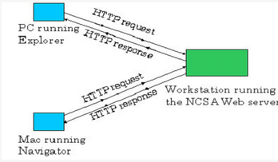
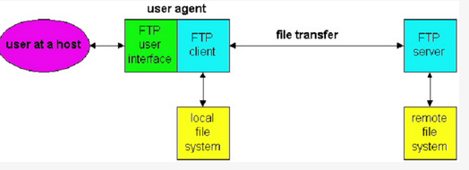

# Chương 2  : Application Layer
## Một số giao thức trong tầng ứng dụng
### MỤC LỤC
[1. Giao thức là gì ](#1)
[2. Các kiến trúc của ứng dụng](#9)
[3. Một số giao thức trong tầng ứng dụng ](#2)
- [3.1 HTTP](#3)
- [3.2 FTP](#4)
- [3.3 Thư điện tử trong Internet](#5)
- [3.4 DNS](#6)

### 1. Giao thức là gì 
- Giao thức là các quy ước để đảm bảo các máy tính trên mạng giao tiếp được với nhau 
 - Giao thức hướng kết nối và giao thức không kết nối
    - Giao thức hướng kết nối 
        - Không kiểm soát đường truyền
        - Dữ liệu không bảo đảm đến được nơi nhận
        - Dữ liệu thường dưới dạng datagrams
    - Giao thức không kết nối
        - Ngược lại với giao thức không kết nối , kiểm soát được đường truyền 
        - Dữ liệu truyền đi tuần tự, nếu nhận thành công thì nơi nhận phải gởi tín hiệu ACK (ACKnowledge)

- Giao thức có khả năng định tuyến và giao thưc không có khả năng định tuyến 
    - Giao thức có khả năng định tuyến 
        - Là các giao thức cho phép đi qua các thiết bị liên mạng như Router để xây dựng các mạng lớn có qui mô lớn hơn
    - Gioa thức không có khả năng định tuyến 
        - Các giao thức này không cho phép đi qua các thiết bị liên mạng như Router để xây dựng các mạng lớn.

### 2. Các kiến trúc của tầng ứng dụng 
- Kiến trúc Client-server:
    - Server: 
        - Host luôn hoạt động  
        - Địa chỉ ip cố định
        - Nhóm các server để chia sẻ công việc
    - Clients:
        - Truyền thông với server
        - Có thể kết nối không liên tục
        - Có thể có địa chỉ ip thay đổi
        - Không truyền thông trực tiếp với client khác

- Peer-to-peer (P2P):

    - Không có server luôn hoạt động
    - Truyền thông trực tiếp với hệ thống đầu cuối bất kỳ
    - Các điểm kết nối không liên tục và thay đổi địa chỉ ip

### 3. Một số giao thức trong tầng ứng dụng 

3.1 HTTP(Hyper Text Tranfer Protocol)

- Giao thức web 
- Port 80
- Định nghĩa cách chyển thông điệp giữa người dùng và máy chủ
- Sử dụng mô hình Client-Server
- Dùng TCP:
    - Client khởi tạo kết nối TCP (tạo socket) đến server, port 80
    - Server chấp nhận kết nối TCP từ client
    - Các thông điệp HTTP (thông điệp giao thức lớp application) trao đổi giữa trình duyệt (HTTP client) và Web server (HTTP server)
    - Đóng kết nối TCP

3.2 FTP(File tranfer protocol)

- Truyền file đến/từ host từ xa
- Mô hình client/server 
    - Client: phía khởi tạo truyền (đến/từ host ở xa)
    - Server: host ở xa
- Port 20,21
- Trao đổi tập tin qua mạng lưới truyền thông 

3.3 Thư điện tử trong Internet
- SMTP(Simple Mail Tranfer Protocol)
    - Port : 25
    - Dùng TCP để truyền tin cậy thông điệp email từ client đến server trên port 25
    - Truyền trực tiếp: server gửi đến server nhận
- POP(Post Office Protocol) 
    - Port : 110 
    - Giao thức nhận thư điện tử 
    - Truy cập từ một thiết bị 
    - Truy cập mail thường xuyên dù có internet hay không 
- IMAP (Internet Mail Access Protocol)
    - Port : 143 
    - Giao thức nhận thư điện tử cho phép truy cập Email từ xa 
    - Truy cập từ nhiều thiết bi chỉ cần có internet 

3.4 DNS(Domain Name System)
- Phân giải tên miền 
    - Tên Host chuyển thành địa chỉ IP
    - Bí danh Host: các tên đúng chuẩn và bí danh
- Các server Top-level domain (TLD) : chịu trách nhiệm cho tên miền com, org, net, edu,… 
- Các DNS server có thẩm quyền: DNS server của tổ chức, cung cấp các tên host có thẩm quyền để ánh xạ IP cho server 

