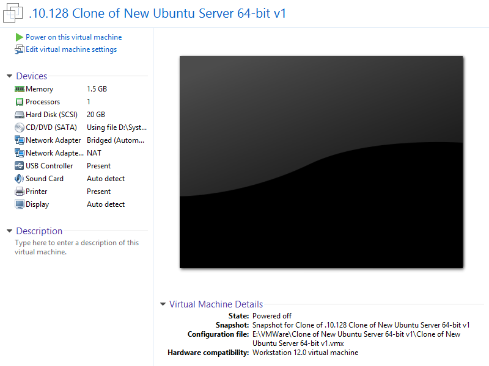
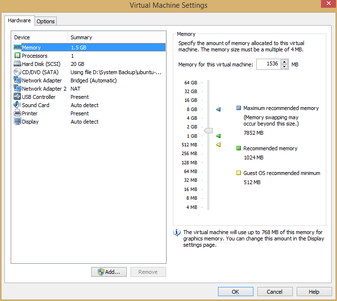
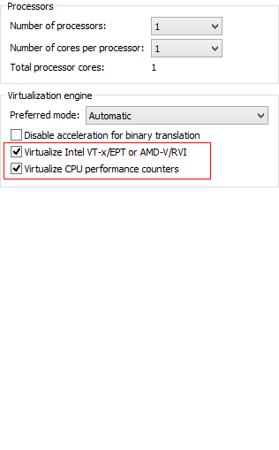

# Cài đặt KVM

# Mục lục

- [Yêu cầu trước khi cài đặt](#pre-install)
- [Cài đặt KVM](#install)

___

# Nội dung

	Lưu ý: Các câu lệnh sẽ sử dụng với quyền của user root.

- # <a name="pre-install">Yêu cầu trước khi cài đặt</a>

	+ Để thực sự KVM chạy được trên máy của bạn, bạn cần phải có một CPU hỗ trợ ảo hóa phần cứng. Itel và AMD đều hỗ trợ ảo hóa, tuy nhiên bạn cần phải biết chính xác nó có thực sự được hỗ trợ ảo hóa hay không bằng cách thực thi câu lệnh sau trên máy chủ cài đặt Linux:
		> `kvm-ok`

	+ Nếu kết quả trả về tương tự như hình sau thì chứng nó CPU của bạn có hỗ trợ ảo hóa phần cứng
		> 

	+ Còn không, bạn hãy cài đặt một máy chủ Linux trên VMWare và kích hoạt chế độ ảo hóa cho phần cứng như sau:
		+ Bước 1: Lựa chọn máy ảo mà bạn muốn kích hoạt ảo hóa để sử dụng tính năng KVM
			> 

		+ Bước 2: Chọn `Edit virtual machine settings`, ta được:
			> 

		+ Bước 3: Chọn mục `Processors` và tích vào 2 mục:
			* [X] Virtualize Intel VT-x/EPT or AMD-V/RVI
			* [X] Virtualize CPU performance counters
			> 
		+ Bước 4: Lưu cài đặt lại và kiểm tra lại xem đã thành công hay chưa. Kết quả
			> 

___

- # <a name="install">Cài đặt KVM</a>

	+ Sau khi chắc chắn rằng máy tính của bạn có hỗ trợ ảo hóa. Bạn hãy thực hiện theo các bước dưới đây để tiến hành cài đặt KVM.
		+ Bước 1: Cài đặt các package cần thiết:
			> `apt-get install qemu-kvm libvirt-bin virtinst`

		+ Bước 2: Kích hoạt tính năng virtual host network cho nhân linux:
			> `modprobe vhost_net && echo vhost_net >> /etc/modules`

		+ Bước 3: Tạo một bridging network để sử dụng cho KVM:
			Bạn hãy theo dõi bài viết sau để tạo ra một bridged interfaces sử dụng cho KVM tại 
			[Bridge Networks Connections](../../Sharing_Network/BridgeNetworkConnections.md).
			Bạn có thể bỏ qua bước này nếu muốn!
___

- Ok, vậy là chúng ta đã tiến hành cài đặt đủ điều kiện để thực hiện việc sử dụng công nghệ ảo hóa kvm trên thiết bị của bạn.

# Nội dung khác

- [Giới thiệu về KVM](../README.md#about)
- [Cài đặt KVM](Installation.md)
- [Cấu hình mạng briding](Networking.md)
- [Tạo một máy ảo kvm](Guest-creation.md)
- [Quản lý các máy ảo kvm](Guest-management.md)
- [Truy cập, sử dụng các máy ảo](Guest-console-access.md)