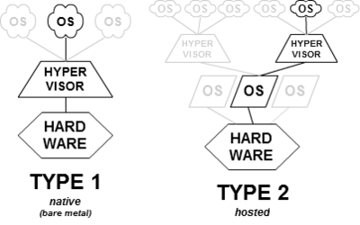

# Overview Of Virtualization

## Ảo hóa là gì?
`Ảo hóa` (`Virtualization`) là việc tạo ra một phiên bản ảo (không phải thực tế) của một thứ gì đó, chẳng hạn như máy tính ảo (virtual machine), ổ đĩa ảo (virtual disk), mạng ảo (virtual network), .v.v.

`Ảo hóa` là công nghệ được thiết kế để tạo ra tầng trung gian giữa hệ thống phần cứng máy tính và phần mềm chạy trên nó. Ý tưởng của công nghệ ảo hóa máy chủ là từ một máy vật lý đơn lẻ có thể tạo thành nhiều máy ảo độc lập.

`Ảo hóa` sử dụng phần mềm mô phỏng chức năng phần cứng để tạo ra một hệ thống ảo. Thực tiễn này cho phép các tổ chức CNTT vận hành nhiều hệ điều hành, nhiều hơn một hệ thống ảo và các ứng dụng khác nhau trên một máy chủ. Lợi ích của ảo hóa bao gồm hiệu quả và hiệu quả kinh tế theo quy mô lớn hơn.

## Phân loại ảo hóa
### Phân loại theo thiết bị
Dưới đây là một số loại ảo hóa được phân loại theo thiết bị:
- Ảo hóa mạng (Network virtualization)
- Ảo hóa lưu trữ (Storage virtualization)
- Ảo hóa máy chủ (Server virtualization)
- Ảo hóa dữ liệu (Data virtualization)
- Ảo hóa máy tính để bàn (Desktop virtualization)
- Ảo hóa ứng dụng (Application virtualization)

### Phân loại theo công nghệ sử dụng
- Full virtualization (ảo hóa toàn phần)
- Paravirtualization( ảo hóa song song )
- Hardware assiseted virtualization ( ảo hóa hỗ trợ phần cứng)
- Ảo hóa hệ điều hành
- Ảo hóa memory
- Ảo hóa thiết bị và I/O
## Một số định nghĩa trong ảo hóa
...

# Overview Of Hypervisor

## Hypervisor là gì?
`Hypervisor` hay có tên khác là `Virtual machine moniter` (`VMM`) dùng để chỉ các phần mềm công nghệ cho phép tạo và quản lý các máy ảo. Quản lý và cho phép máy ảo truy cập vào tài nguyên phần cứng. Như vậy ta có thể hiểu ảo hóa là phương pháp tạo ra máy ảo còn hypervisor là một công nghệ để tạo máy ảo và giám sát, điều khiển nó.

## Các loại hypervisor
Có 2 loại hypervisor là `Native` hay `Bare metal` và `Host Based`:

### Native (Bare-metal)
Một hypervisor ở dạng native (hay còn gọi “bare-metal”) chạy trực tiếp trên phần cứng. Nó nằm giữa phần cứng và một hoặc nhiều hệ điều hành khách (guest operating system). Nó được khởi động trước cả hệ điều hành và tương tác trực tiếp với kernel. Điều này mang lại hiệu suất cao nhất có thể vì không có hệ điều hành chính nào cạnh tranh tài nguyên máy tính với nó. Tuy nhiên, nó cũng đồng nghĩa với việc hệ thống chỉ có thể được sử dụng để chạy các máy ảo vì hypervisor luôn phải chạy ngầm bên dưới. Các hypervisor dạng native này có thể kể đến như VMware ESXi, Microsoft Hyper-V và Apple Boot Camp.

### Host Based
Một hypervisor dạng hosted được cài đặt trên một máy tính chủ (host computer), mà trong đó có một hệ điều hành đã được cài đặt. Nó chạy như một ứng dụng cũng như các phần mềm khác trên máy tính. Hầu hết các hypervisor dạng hosted có thể quản lý và chạy nhiều máy ảo cùng một lúc. Lợi thế của một hypervisor dạng hosted là nó có thể được bật lên hoặc thoát ra khi cần thiết, giải phóng tài nguyên cho máy chủ. Tuy nhiên, vì chạy bên trên một hệ điều hành, nó có thể đem lại hiệu suất tương tự như một hypervisor ở dạng native. Ví dụ về các hypervisor dạng hosted bao gồm VMware Workstation, Oracle VirtualBox và Parallels Desktop for Mac.

Nói chung, các hypervisor dạng hosted phổ biến cho việc sử dụng cá nhân và doanh nghiệp nhỏ, trong khi các hypervisor dạng native được sử dụng cho các ứng dụng doanh nghiệp và điện toán đám mây – cloud computing.

# Tài liệu tham khảo
- [techtarget.com](https://searchservervirtualization.techtarget.com/definition/virtualization)
- [hoangit.org](http://hoangit.org/ao-hoa-la-gi/)
- [thegioimaychu.vn](https://www.thegioimaychu.vn/blog/thuat-ngu/hypervisor/)

# Missing
- Ring là gì?
- Một số khái niệm liên quan
- Ưu, Nhược điểm