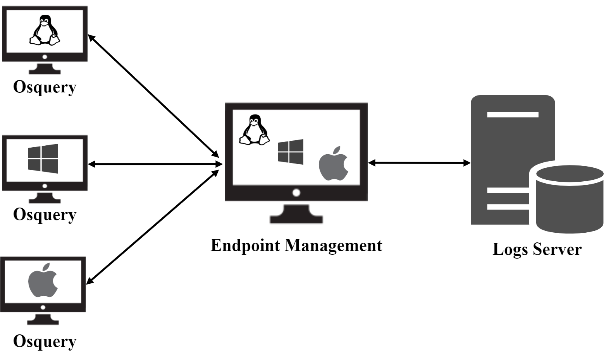
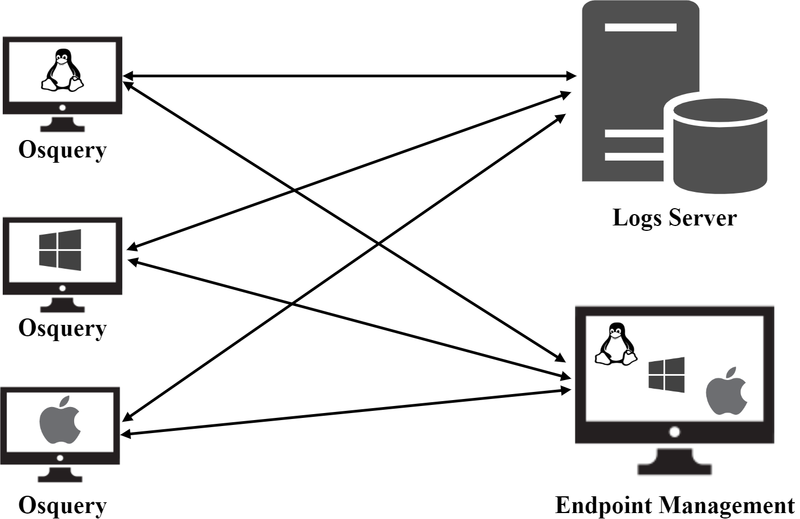

# INTRODUCTION OSQUERY

## Osquery là gì?
OSquery là một framework mã nguồn mở do Facebook tạo ra và được công bố lần đầu vào năm 2014, nó là một phần mềm đa nền tảng, hiện nay osquery có sẵn cho các môi trường Windows, OSX (macOS), Linux và FreeBSD. Osquery giúp phân tích và giám sát hệ điều hành ở cấp thấp (low-level) vô cùng hiệu suất và trực quan.

Osquery sử dụng các API cấp thấp của hệ điều hành để có được các thông tin về một hệ thống và lưu trữ trong một cơ sở dữ liệu quan hệ hiệu năng cao. Điều này cho phép ta viết các truy vấn SQL để khám phá dữ liệu hệ điều hành. Với osquery, các bảng SQL biểu thị các khái niệm trừu tượng như các tiến trình đang chạy, các mô-đun hạt nhân được tải, các kết nối mạng đang mở, các plugin trình duyệt, các sự kiện phần cứng hoặc các hàm băm của các tệp.

Osquery đóng vai trò như một agent trong các giải pháp về bảo mật theo cơ chế HIDS (Host-based intrusion detection system), nó giúp các quản trị viên hệ thống và các các tổ chức điều tra phát hiện mã độc giám sát và phân tích các hoạt động động hại trong môi trường mạng của mình, các truy vấn SQL cho phép giám sát thời gian thực và nhanh chóng phát hiện hành vi độc hại hay các ứng dụng xấu trong mạng nội bộ, tính năng này đặc biệt quan trọng đối với quản trị viên trong xử lý sự cố, chuẩn đoán hệ thống và các vấn đề mức mạng.

## Tính năng đặc điểm của Osquery
Osquery là một framework vô cùng mạnh mẽ với rất nhiều tính năng đặc điểm nổi bật, đóng vai trò như một agent trên một endpoint giúp các nhà phát triển có thể triển khai những giải pháp bảo mật cho hệ thống của mình, sau đây là một số tính năng đặc điểm nổi bật của osquery:
- Là phần mềm mã nguồn mở hỗ trợ đa nên tảng và hoàn toàn miễn phí
- Giám sát hệ thống ở nhiều khía cạnh khác nhau vô cùng hiệu quả
- Lưu trữ thông tin về hệ thống trong một cơ sở dữ liệu quan hệ hiệu năng cao
- Hỗ trợ API cho phép các nhà phát triển dễ dàng kết hợp với các nền tảng khác
- Hỗ trợ lập lịch cho các truy vấn, giúp thực hiện các truy vấn theo một tru kỳ xác định
- Có thể hoạt động như một công cụ giúp các nhà điều tra phân tích hệ thống một cách trực quan và hiệu quả
- Hỗ trợ nhiều phương thức xuất kết quả đầu ra khác nhau
- Kết quả đầu ra của các truy vấn dưới định dạng json giúp dễ dàng thao tác và chuyển đổi
- Có thể dễ dàng triển khai kết hợp với các mô hình khác nhau tạo nên các giải pháp bảo mật toàn diện

## Các thành phần của Osquery
Sau khi cài đặt osquery cung cấp kèm theo cho ta đầy đủ các thành phần cho phép ta dễ dàng tương tác và sử dụng, sau đây là các thành phần của osquery:
- Osqueryi: Osqueryi là một vỏ (shell) tương tác, nó dùng để thực hiện các truy vấn đặc biệt cũng như các truy vấn nhanh chóng, rất hưu ích khi ta sử dụng nó như một công cụ điều tra, phân tích hệ thống nhằm phát hiện sự cố hoặc điều tra mã độc. Trong chế độ shell này, nó hoàn toàn độc lập, không giao tiếp với trình nền (Osqueryd) và không cần chạy với tư cách quản trị viên (mặc dù một số bảng có thể trả về ít kết quả hơn khi chạy với tư cách không phải quản trị viên).
- Osqueryd: Osqueryd là một trình nền (daemon) giám sát máy chủ cho phép ta lên lịch truy vấn và ghi lại các thay đổi trạng thái của hệ điều hành. Trình nền tổng hợp kết quả truy vấn theo thời gian và tạo nhật ký (log), biểu thị trạng thái thay đổi theo từng truy vấn. Trình nền cũng sử dụng API sự kiện hệ điều hành để ghi lại các thay đổi thư mục và tệp được theo dõi, các sự kiện phần cứng, sự kiện mạng và hơn thế nữa.
- Osqueryctl: Osqueryctl (osquery controller) là một kịch bản trợ giúp để ta dễ dàng tương tác với trình nền osqueryd như bắt đầu (start), dừng lại (stop) và khởi khộng lại (restart), ngoài ra nó còn hộ trợ ta thử nghiệm triển khai hoặc cấu hình của mình trước khi áp dụng.

## Mô hình triển khai với Osquery
Osquery là một phần mềm vô cùng mạnh mẽ trong giám sát bảo mật điểm cuối, không những thế nó còn hỗ trợ nhiều phương thức xuất kết quả truy vấn và API mạnh mẽ giúp ta có thể dễ dàng kết hợp với với các nền tảng khác tạo ra một stack về giám sát bảo mật hoàn chỉnh, Sau đây là các mô hình triển khai với osquery:

 
Như trong mô hình trên ta sử dụng osquery tại các điểm endpoint để giáp sát và sau đó kết quả của việc giám sát sẽ được gửi tới một endpoint management sau đó tiếp tục được gửi tới logs server, dưới đây là chi tiết về chức năng của các thành phần trong mô hình trên:
- Osquery: Là thành phần chính trong mô hình, nó đóng vai trò như môt agent ở điểm cuối, thực hiện các truy vấn và gửi kết quả đén endpoint management
- Endpoint Management: Chịu trách nhiệm quản lý các osquery client, các cấu hình của client cũng như quản lý các truy vấn và áp dụng các truy vấn lập lịch cho các client. Ngoài ra nó sẽ nhận lại kết quả từ client phân tích và cảnh báo theo các điều kiện được xác định trước, sau đó các kết quả sẽ được chuyển tiếp qua logs server.
- Logs server: Nơi sẽ nhận các log và quản lý chúng tập chung, một số hệ thống quản lý log tập chung có thể sử dụng như graylog, EKL, Splunk .v.v.

Dưới đây là một mô hình triển khai khác với osquery, trong mô hình này các các osquery client sẽ gửi kết quả trực tiếp tới logs server thay vì đi qua endoint management:

