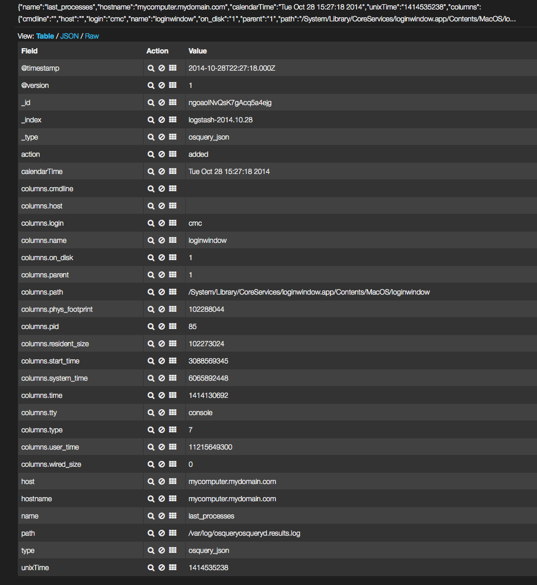
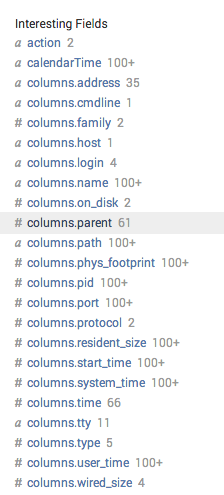

# Aggregating Logs
Osquery được thiết kế để làm việc với bất kỳ cơ sở hạ tầng dữ liệu hiện có nào. Do không gian vấn đề của nhật ký chuyển tiếp được phát triển rất tốt, osquery không thực hiện chuyển tiếp nhật ký nội bộ.

Nói tóm lại, chuyển tiếp nhật ký và phân tích nhật ký hầu hết chỉ là một bài tập cho người đọc. Trang này cung cấp lời khuyên và một số tùy chọn để bạn xem xét, và cuối cùng bạn nắm rõ cơ sở hạ tầng của mình và và có thể đưa ra quyết định triển khai dựa trên kiến ​​thức đó.

## Aggregating logs (Nhật ký tổng hợp)
Khi nói đến việc tổng hợp các bản ghi mà osqueryd tạo ra, bạn có một số tùy chọn. Nếu bạn sử dụng plugin logger filesystem (mặc định), thì bạn có trách nhiệm vận chuyển nhật ký ở đâu đó. Có nhiều sản phẩm nguồn mở và thương mại nổi trội trong lĩnh vực này. Phần này sẽ khám phá một vài trong số các tùy chọn đó.

### Logstash
LogStash là một công cụ nguồn mở cho phép bạn thu thập, phân tích, lập chỉ mục và chuyển tiếp nhật ký. Logstash cho phép bạn nhập nhật ký osquery với plugin sử dụng input file và sau đó gửi dữ liệu đến bộ tổng hợp thông qua một danh sách các output plugins. Một kho dữ liệu phổ biến cho logstash là `ElasticSearch`.

Một ví dụ cấu hình Logstash to ElasticSearch có thể trông như thế này:

```
input {
  file {
    path => "/var/log/osquery/osqueryd.results.log"
    type => "osquery_json"
    codec => "json"
  }
}

filter {
   if [type] == "osquery_json" {
      date {
        match => [ "unixTime", "UNIX" ]
      }
   }
}

output {
  stdout {}
  elasticsearch {
     hosts=> "127.0.0.1:9200"
  }
}
```

Điều này sẽ gửi các bản ghi được định dạng JSON từ results log đến một ElasticSearch đang lắng nghe trên `127.0.0.1`. Đây có thể là một node Elaticsearch tại bất kỳ địa chỉ endpoint nào.


### Splunk
Nếu bạn sử dụng Splunk, có lẽ bạn đã quen thuộc với Splunk Universal Forwarder. Một ví dụ cấu hình Splunk Forwarder (input) có thể trông như sau:
```
[monitor:///var/log/osquery/osqueryd.results.log]
index = main
sourcetype = osquery:results

[monitor:///var/log/osquery/osqueryd.*INFO*]
index = main
sourcetype = osquery:info

[monitor:///var/log/osquery/osqueryd.*ERROR*]
index = main
sourcetype = osquery:error

[monitor:///var/log/osquery/osqueryd.*WARNING*]
index = main
sourcetype = osquery:warning
```

### Fluentd
[Fluentd](https://www.fluentd.org/) là một trình thu thập dữ liệu nguồn mở và chuyển tiếp nhật ký. Nó rất mở rộng và nhiều người chửi rủa nó.

### Rsyslog
rsyslog là một dịch vụ chuyển tiếp nhật ký UNIX đã thử và thử nghiệm. Nếu bạn đang triển khai osqueryd trong môi trường Linux sản xuất mà bạn không phải lo lắng về các kết nối mạng bị mất, đây có thể là lựa chọn tốt nhất của bạn.


## Analyzing logs
Cách bạn phân tích nhật ký rất phụ thuộc vào cách bạn tổng hợp nhật ký. Osquery tạo ra các bản ghi kết quả ở định dạng JSON, vì vậy các bản ghi rất dễ phân tích trên hầu hết các nền tảng tổng hợp nhật ký phụ trợ hiện đại.


### Kibana
Nếu bạn đang chuyển tiếp nhật ký với `LogStash` sang `ElasticSearch` , thì có lẽ bạn muốn thực hiện phân tích của mình bằng Kibana .

`Logstash` sẽ lập chỉ mục đăng nhập vào `ElasticSearch` bằng định dạng chỉ mục mặc định của `logstash-YYYY-MM-DD`. Kibana có bảng điều khiển Logstash mặc định và tự động trích xuất trường tất cả các dòng nhật ký làm cho chúng có sẵn để tìm kiếm.

Một ví dụ về mục nhật ký Kibana:




### Splunk
Splunk sẽ tự động trích xuất các trường có liên quan để phân tích, như được hiển thị bên dưới:




### Rsyslog, Fluentd, Scribe, etc.
Nếu bạn đang sử dụng trình chuyển tiếp nhật ký có ít yêu cầu hơn về cách lưu trữ dữ liệu (ví dụ: Splunk Forwarder yêu cầu sử dụng Splunk, v.v.), thì bạn có nhiều tùy chọn về cách bạn có thể tương tác với dữ liệu osqueryd. Bạn nên sử dụng bất kỳ nền tảng phân tích nhật ký nào mà bạn cảm thấy thoải mái.

Nhiều người rất thoải mái với Logstash. Nếu bạn đã có một triển khai Logstash/Elaticsearch hiện tại, đó là một lựa chọn tuyệt vời để thực hiện. Nếu tổ chức của bạn sử dụng một giải pháp quản lý nhật ký phụ trợ khác nhau, osquery nên kết hợp với điều đó với nỗ lực tối thiểu.