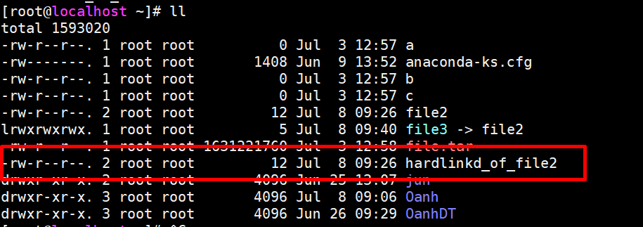

## Description 
-  Lệnh `ln` tạo liên kết giữa các tập tin.Có thể tạo liên kết cứng và liên kết mềm.
## Các Options của command

|Options|Result |
|---|---|
|-n | coi LINK_NAME như một tệp bình thường nếu đó là một liên kết tượng trưng đến một thư mục|
|-P|tạo liên kết cứng trực tiếp đến liên kết tượng trưng|
|-r| tạo liên kết tượng trưng liên quan đến vị trí liên kết|
|-s|  tạo liên kết tượng trưng thay vì liên kết cứng|
|-t|Chỉ định trực tiếp để tạo các liên kết|
|-v|in tên của từng tập tin được liên kết|

## Ví dụ

### 1. Ví dụ tạo một liên kết cứng của file1 đã tồn tại. 
```
[root@localhost ~]# echo "day la file" > file1
[root@localhost ~]# cat file1
day la file
[root@localhost ~]# ln file1 file2
[root@localhost ~]# cat file2
day la file
```

- Hoặc
```
[root@localhost ~]# ln -v file2 hardlinkd_of_file2
‘hardlinkd_of_file2’ => ‘file2’
```
Sau đó chúng ta dùng lệnh `ll` để kiểm tra 



- Trong trường hợp xóa file gốc đi thì khi `cat` file liên kết vẫn in ra nội dung.

```
[root@localhost ~]# cat hardlinkd_of_file2
day la file
```
- Liên kết cứng rất hữu ích vì nó tiết kiệm không gian 

### 2. Tạo liên kết mềm cho file 

```
[root@localhost ~]# ln -s file file1
[root@localhost ~]# ls -li file*
2223884 -rw-r--r--. 1 root root 13 Jul  8 09:52 file
2223885 lrwxrwxrwx. 1 root root  4 Jul  8 09:52 file1 -> file
[root@localhost ~]#
```

- Hoặc : 
```
[root@localhost ~]# ln -sv file symbolic_link_of_file
‘symbolic_link_of_file’ -> ‘file’
```
- Trong trường hợp xóa bỏ file gốc sẽ dẫn đến liên kết mềm (symbolic links) cũng không còn hiệu lực vì đã "chỉ đến cái tên" mà nó lại đã bị xóa. 


