# 3. Thực hiện cấu hình Multiple WAN trong pfSense

____

# Mục lục

- [3.1 Vai trò, chức năng của multiple wan trong pfsense](#about)
- [3.2 Mô hình thực hiện](#models)
- [3.3 Thực hiện cấu hình](#config)
- [3.4 Kiểm tra kết quả](#checking)
- [Các nội dung khác](#content-others)

____

# <a name="content">Nội dung</a>

- ### <a name="about">3.1 Vai trò, chức năng của multiple wan trong pfsense</a>

    - Trong pfSense, với việc thực hiện cấu hình multiple WAN có vai trò như sau:

        + Đảm bảo các thiết bị trong LAN có thể kết nối internet với mức độ sẵn sàng cao nhất.
        + Kết hợp tính năng, đảm bảo vai trò của pfSense như một Load Balancer, cho phép client truy cập vào các dịch vụ cung cấp phía bên trong mạng LAN.
        + Khắc phục sự cố khi có lỗi phát sinh xảy ra.

- ### <a name="models">3.2 Mô hình thực hiện</a>

    > 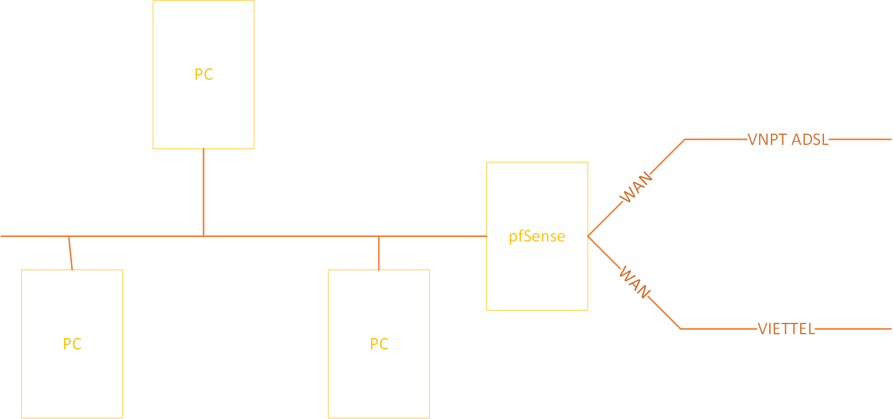

    Trong mô hình trên, ta sẽ sử dụng VMWare để cấu hình cho pfSense. Trong đó, máy ảo cài đặt pfSense có ít nhất 3 card mạng:

        - WAN VNPT ADSL là một Network Interface sử dụng cơ chế NAT.
        - WAN VIETTEL là một Network Interface sử dụng cơ chế Bridge.
        - Một Network Interface LAN.

    - Việc cấu hình pfSense thông qua Web Interface của pfSense. Nội dung cấu hình là phần tiếp theo của [Cài đặt pfSense](pfsense-about.md)

- ### <a name="config">3.3 Thực hiện cấu hình</a>

    - Các bước thực hiện cấu hình Multiple WAN cho pfSense như sau:

        + Bước 1. Thực hiện cấu hình cho các đường WAN:

            - Tại giao diện Web Interface, ta chọn Menu `Interfaces`, ta chọn `Assignments`, sau đó chọn `Add` để thêm mới một `Network Interfaces` cho pfSense. Kết quả:

                > 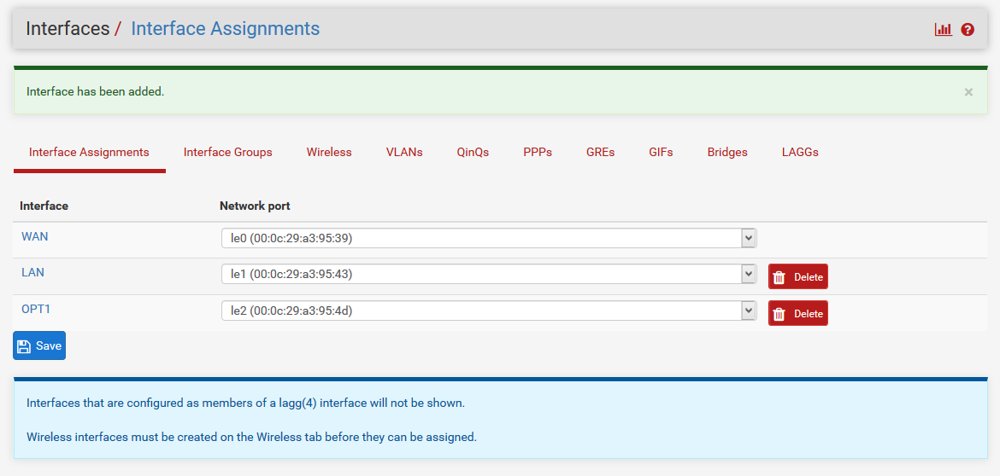

                trong đó:
                - `WAN` sử dụng Network Interface theo cơ chế NAT
                - `LAN` sử dụng Network Interface theo cơ chế Host-Only
                - `OPT1` sử dụng Network Interface theo cơ chế Bridge.

            - Nhấp double vào `WAN`, tại phần `Description`, ta nhập `VNPT` để thực hiện đổi tên cho Network Interface:

                > 

                tại mục `Reserved Networks` ta bỏ chọn `Block private networks and loopback addresses`:

                > 

            - Chọn `Save` để lưu lại cấu hình và chọn `Apply Changes` để thực hiện áp dụng thay đổi của cấu hình.

            - Tiếp tục cấu hình cho `OPT1`, ta chọn Menu `Interfaces`, ta chọn `OPT1`, để thực hiện cấu hình cho Network Interface `OPT1`. tại mục `General Configuration` tại phần `Description`, ta nhập `VIETTEL` để thực hiện đổi tên cho Network Interface, tiếp tục tích vào ô vuông `Enable interface` để kích hoạt interface này, tại mục `IPv4 Configuration Type` ta chọn `Static IPv4` để cấu hình địa chỉ IP tĩnh cho interface:

                > 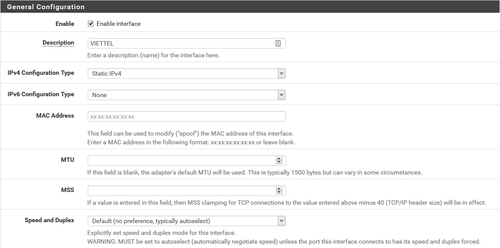

            - Tại mục `Static IPv4 Configuration` ta nhập địa chỉ IP trong dải IP kết nối internet của máy vật lý và chọn `netmask` tương ứng. Ví dụ:

                > 

                tiếp theo ta chọn `Add new gateway` để thêm mới gateway cho interface. Ví dụ, ta thực hiện thêm thông tin như sau:

                > 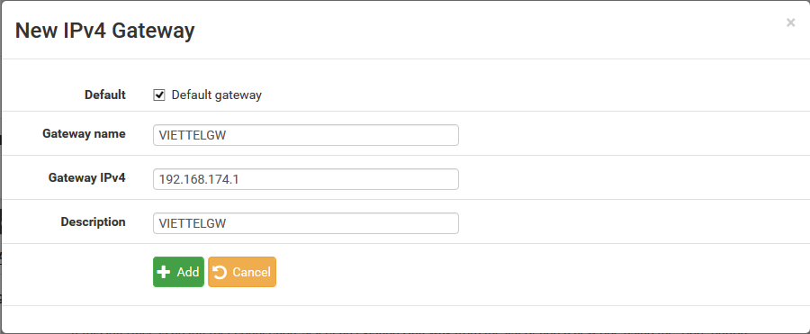

                chọn `Save` để lưu lại, kết quả ta nhận được như sau:

                > 

            - Tại mục `Reserved Networks` ta bỏ chọn `Block private networks and loopback addresses`:

                > 

            - Chọn `Save` để lưu lại cấu hình và chọn `Apply Changes` để thực hiện áp dụng thay đổi của cấu hình.

        + Bước 2. Tạo `Gateway Groups` bằng việc ta chọn menu `System`, sau đó chọn `Routing`, tiếp tục chọn `Gateway Groups`, chọn `Add` để thêm mới một group. Thực hiện điền các thông tin tương tự hình dưới đây:

            > 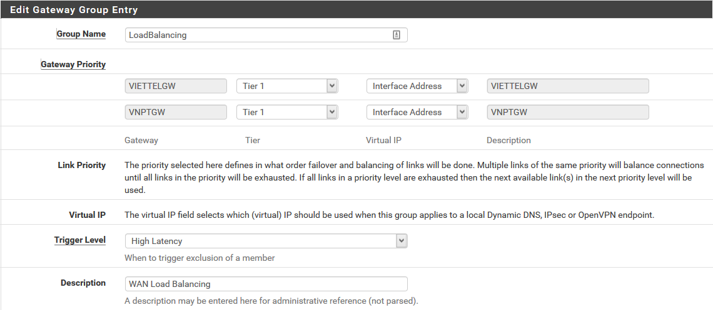

            chọn `Save` để lưu lại cấu hình.
            - Tương tự ta thực hiện thêm 2 `Gateway Groups` nữa là `FailOver1` và `FailOver2` với nội dung như sau:

                + Group `FailOver1`:

                    > 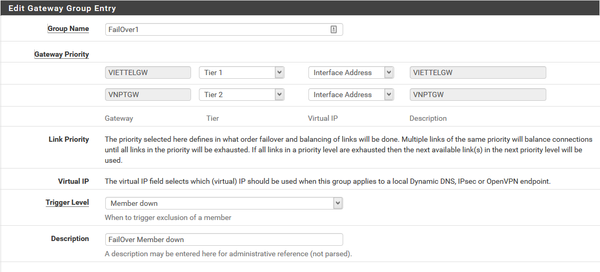

                + Group `FailOver2`:

                    > 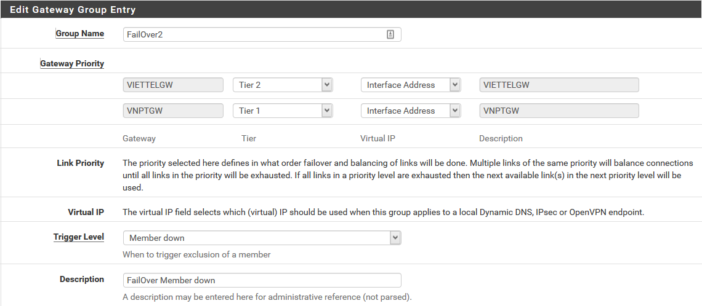

            - Kết quả sẽ thu được như sau:

                > 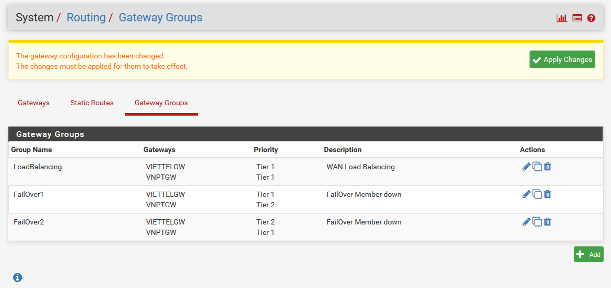

                chọn `Apply Changes` để chấp nhận thay đổi cấu hình.

                trong đó `Tier` quy định thứ tự ưu tiên của các gateway. Gateway có `Tier` với chỉ số thấp sẽ được ưu tiên sử dụng trước.

            - Trong quá trình tạo ra một `Gateway Groups`, tại phần `Trigger Level` ta có các giá trị với các hành động tương ứng như sau:

                + `Member down`: Thực hiện chuyển đổi sang một gateway khác khi một gateway thành viên đang được sử dụng bị mất liên lạc, ...
                + `Packet loss`: Thực hiện chuyển đổi sang một gateway khác khi một gateway thành viên đang được sử dụng xảy ra hiện tượng thiết hụt gói tin, ...
                + `High Latency`: Thực hiện chuyển đổi sang một gateway khác khi một gateway thành viên đang được sử dụng xảy ra hiện tượng có độ trễ cao, ...

        + Bước 3. Tạo rule firewall cho LAN đến các gateway bằng cách chọn menu `Firewall`, tiếp theo ta chọn `Rules` sau đó chọn `LAN`. Kết quả:

            > 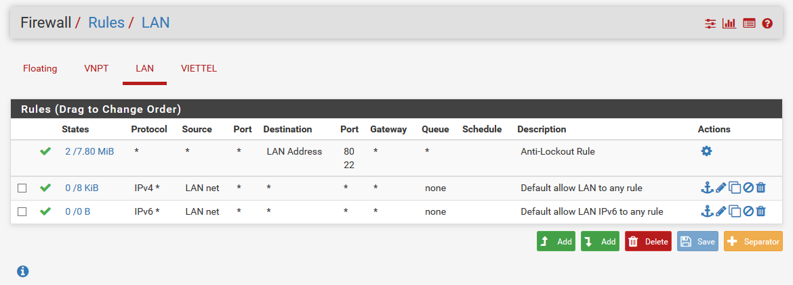

            chọn `Add` để thêm mới một rule cho firewall. Tiếp tục chọn `Display Advanced` để hiển thị thêm nhiều tùy chọn hơn. Sau đó thực hiện thêm các thông tin tương tự như các hình dưới để tạo ra các rules. Chọn `Save` để lưu lại cấu hình cho rule.

            - Rule sử dụng LoadBalancing gateway:

                > 

            - Rule sử dụng FailOver1 gateway:

                > 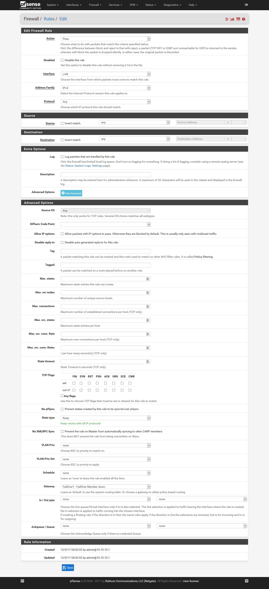

            - Rule sử dụng FailOver2 gateway:

                > 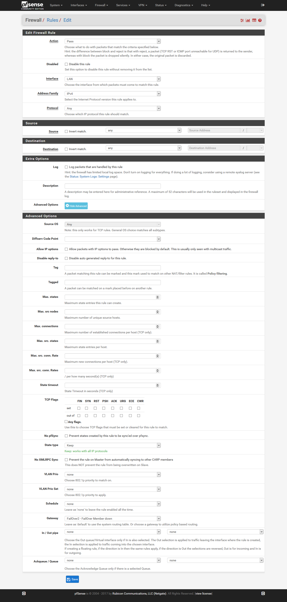

            - Kết quả cuối cùng ta thu được như sau:

                > 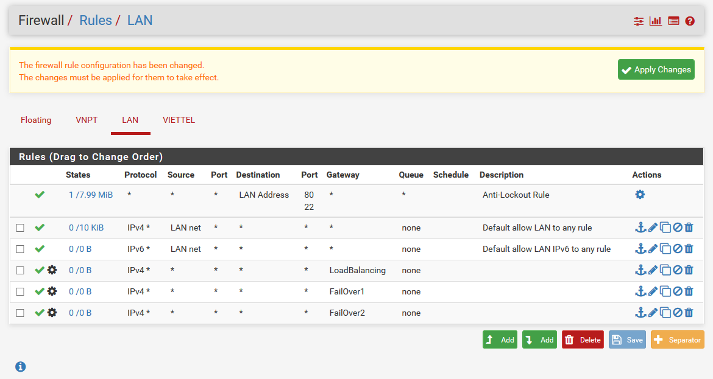

                chọn `Apply Changes` để thực hiện áp dụng thay đổi.

        + Bước 4. Cấu hình DNS cho gateway bằng cách chọn menu `System`, chọn `General Setup`. Tại mục `DNS Server Settings`:

            > 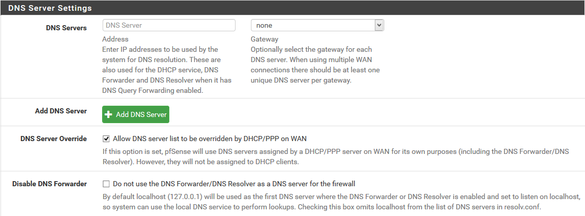

            ta nhập thông tin và lựa chọn tương tự như hình sau:

            > 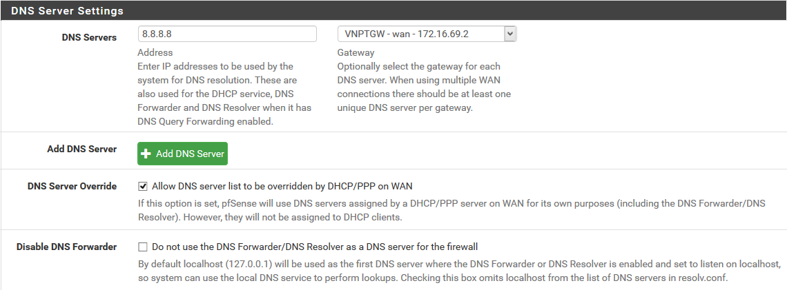

            chọn `Add DNS Server` để thêm mới một server. Sau đó tiếp tục thực hiện nhập và lựa chọn thông tin như hình sau:

            > 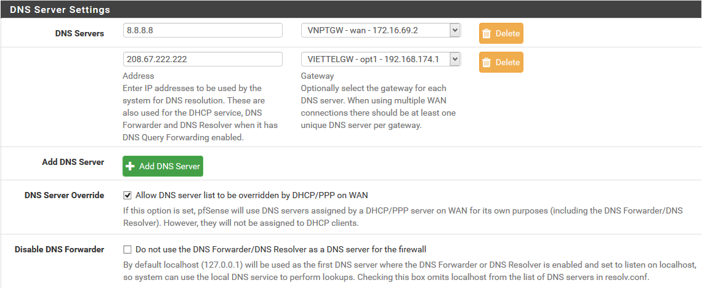

            Chọn `Save` để lưu lại cấu hình.

        + Bước 5. Cấu hình tự động chuyển đổi default gateway khi phát sinh lỗi bằng cách chọn menu `System`, sau đó chọn `Advanced` rồi chọn `Miscellaneous`. Tại mục `Load Balancing`, ta lựa chọn tích vào ô `Enable default gateway switching`.

            > 

            chọn `Save` để lưu lại.

    - Như vậy, về cơ bản ta đã thực hiện hoàn tất cho cấu hình.

- ### <a name="checking">3.4 Kiểm tra kết quả</a>

    - Để thực hiện kiểm tra kết quả. Ta chọn menu `Status`, rồi chọn `Gateways`. Kết quả thu được tương tự như sau:

        > 

        > 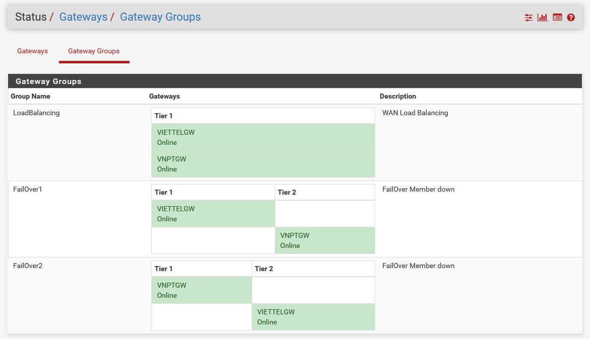

    - Sau khi ta thực hiện ngắt kết nối một interfaces đối với máy ảo pfSense, ta thu được kết quả như sau:

        > 

        > 

    - Thực hiện truy cập internet từ một PC trong mạng LAN có trỏ DNS tới địa chỉ LAN của pfSense. Ta thu được kết quả như sau:

        > 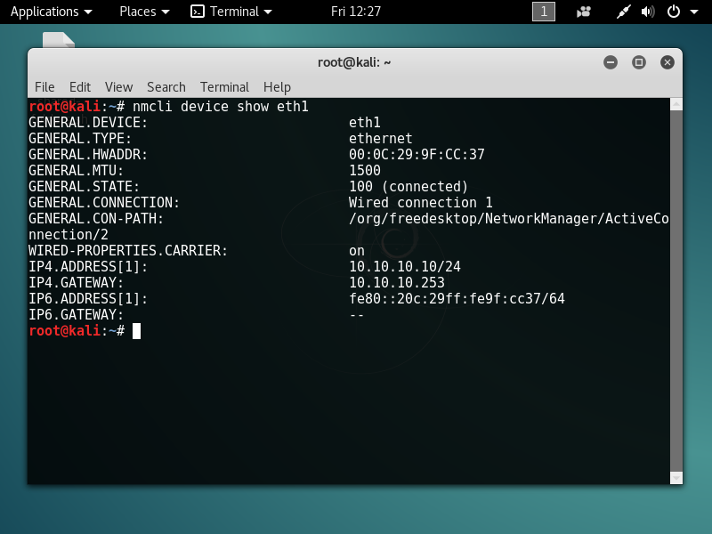

        > 

____

# <a name="content-others">Các nội dung khác</a>
