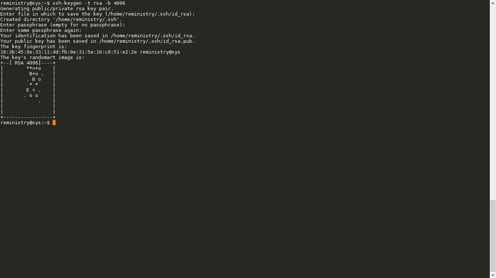
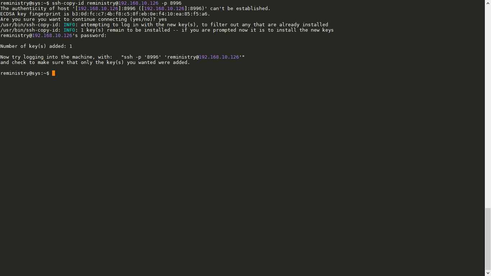
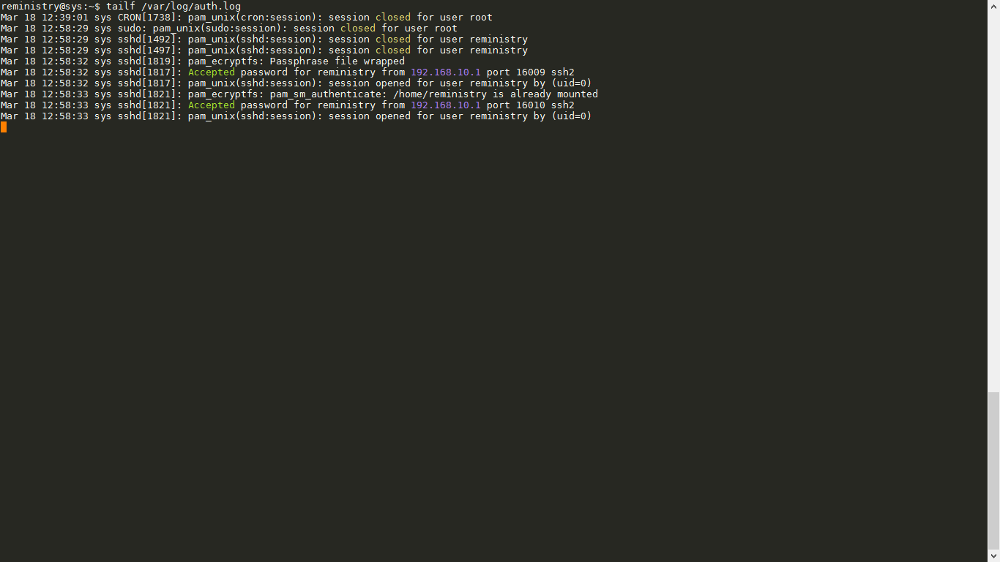

# Báo cáo: Tìm hiểu kỹ thuật SSH

### Mục lục

1. Giới thiệu
    - 1.1 [SSH là gì](#sshLaGi)
    
    - 1.2 [SSH hoạt động như thế nào](#hoatdong)
    
    - 1.3 [Chứng thực người dùng](#chungthuc)
    
    - 1.4 [Tạo và sử dụng khóa cho chứng thực](#taokhoa)
2. Các cấu hình SSH và cách remote từ xa
    - 2.1 [Hướng dẫn kết nối cơ bản](#ketnoi)
    
    - 2.2 [Cấu hình SSH](#cauhinh)

## 1. Giới thiệu

### 1.1 SSH là gì

- SSH là viết tắt của `Socket Secure Shell` là một giao thức mạng cho phép thiết lập kết nối mạng một cách bảo mật để điều khiển một Linux server từ xa.
- SSH hoạt động tại lớp Application trong mô hình TCP/IP
- SHH được kết nối thông qua cổng mặc định là 22

### 1.2 SSH hoạt động như thế nào?

- Khi bạn kết nối thông qua SSH, bạn sẽ có được một phiên hoạt động SSH và có thể giao tiếp với server của bạn từ xa thông qua giao diện dòng lệnh.
- Trong phiên hoạt động, các câu lệnh mà bạn nhập vào trên terminal để yêu cầu server thực hiện đều được gửi qua một kênh SSH đã được mã hóa nội dung
- Mọi kết nối SSH đều được thực hiện trên mô hình client-server. Vì vậy mà để có được một kết nối SSH, thiết bị của bạn buộc phải được cài đặt phần mềm hỗ trợ kết nối SSH (SSH daemon) - Phần mềm này sẽ lắng nghe hoạt động treen các cổng mạng đã khai báo, chứng thực yêu cầu kết nối và sinh ra một môi trường thích hợp cho kết nối SSH

### 1.3 Chứng thực người dùng

- Các kết nối SSH từ client đều được chứng thực bởi password "clear text" (bảo mật kém) hoặc sử dụng SSH keys (bảo mật cao)
- Các password "clear text" thường là mật khẩu của tài khoản người dùng được quyền truy cập vào hệ thống remote. Tuy nhiên nó kém bảo mật bởi những hacker có thể thực hiện "brute force" để đăng nhập vào hệ thống qua SSH sử dụng password "clear text". Đây chính là lí do tại sao bạn nên cấu hình lại cách mà SSH chứng thực người dùng.
- SSH keys là một cặp khóa bất đối xứng dùng để xác thực người dùng. Mỗi cặp khóa bao gồm:
    + Public key:
        - Cho phép mã hóa gói tin
        - Được đặt tại server
        - Được phép tự do chia sẻ khóa
    + Private key:
        - Cho phép giải mã các gói tin được mã khóa bởi Public keys
        - Được đặt tại client
        - Phải được giữ bí mật và không được tiết lộ cho bất kỳ ai.
- Để sử dụng SSH keys, một người dùng phải có một cặp khóa SSH trên máy tính của họ. Trên thiết bị remote server, nội dung khóa public phải tồn tại trong thư mục home của người dùng đó trong file `~/.ssh/authorized_keys`.
- Khi một client kết nối tới remote server muốn sử dụng SSH key để chứng thực, client sẽ gửi tới server ý định đó kèm khóa public để sử dụng. Server sẽ kiểm tra nội dung khóa public với nội dung file `authorized_keys`. Nếu khớp nhau, một chuổi bất kỳ sẽ được sinh ra và mã hóa bởi public key và chỉ được giải mã khi có private key. Server sẽ gửi nó tới client để kiểm tra xem liệu client có private key.
- Sau khi nhận được chuỗi mã hóa trên, client sẽ giải mã nó bằng việc sử dụng private key và kết hợp với một chuỗi bất kỳ liên quan đển session ID và sinh ra một MD5 hash gửi ngược trở lại server.
    > 

### 1.4 Tạo và sử dụng khóa cho chứng thực

#### 1.4.1 Tạo cặp khóa RSA
- SSH hỡ trợ xác thực nhiều loại khóa nhứ rsa (mặc định), sha ...  cho quá trình xác thực. Để sinh ra một cặp khóa, bạn sử dụng câu lệnh:
    > `ssh-keygen -t type_key -b numbers_bits_key`
- Mặc định kiểu khóa được tạo ra là rsa và số bits khóa là 2048 nên bạn có thể sử dụng câu lệnh sau:
    > `ssh-keygen`

    Kết quả là:

    > `Generating public/private rsa key pair.`
    
    > `Enter file in which to save the key (/home/demo/.ssh/id_rsa):`
    
    Cho phép bạn chọn vị trí lưu file RSA keys. Mặc định, chúng sẽ được lưu trữ trong thư mục ẩn `.ssh` của đường dẫn người dùng.

    > `Enter passphrase (empty for no passphrase):`
    
    > `Enter same passphrase again:`

    Dấu nhắc tiếp theo cho phép bạn nhập cụm từ mật khẩu có độ dài tùy ý để bảo vệ khóa cá nhân của bạn. Có thể bỏ qua bằng việc nhấn `Enter` nhưng hãy lưu ý rằng điều này sẽ cho phép bất cứ ai kiểm soát được khoá cá nhân của bạn để đăng nhập vào server.
    Kết quả là:
    

    Các khóa được tạo ra sẽ lưu trong `~/.ssh/` với:
    - `~/.ssh/id_rsa`: Đây là khóa bí mật! KHÔNG ĐƯỢC CHIA SẺ FILE NÀY!
    - `~/.ssh/id_rsa.pub`: Đây là khóa công khai. Có thể được chia sẻ tự do.
- Các hoạt động trên được thực hiện phía client

#### 1.4.2 Copy khóa public lên server.
- Có nhiều cách để gửi khóa public lên server như sử dụng lệnh, các cách thủ công như copy ra thiết bị lưu trữ ... Trong SSH có hỗ trợ câu lệnh để copy khóa lên server như `ssh-copy-id` hay `scp`, ...
- Việc copy khóa public lên server cho phép bạn chứng thực người dùng không cần mật khẩu, tại client bạn sử dụng lệnh sau:
    > `ssh-copy-id username@ip_remote_host -p port`

    > 

- Ngay bây giờ, bạn có thể log vào server không cần dùng mật khẩu với:
    > `ssh username@ip_remote_host -p port`

## 2. Các cấu hình SSH và cách remote từ xa

### 2.1 Hướng dẫn kết nối cơ bản
- Để kết nối tới một remote server và mở một phiên SSH ở đó, bạn có thể dụng câu lệnh ssh.
- Để remote server với một username tương tự như username trên máy local của bạn, bạn có thể dùng câu lệnh:
    > `ssh ip_remote_host -p port`
- Nếu username local của bạn khác với username trên remote server, bạn cần khai báo nó như sau:
    > `ssh username@ip_remote_host -p port`

- Trong trường hợp, bạn chỉ cần chạy một câu lệnh trên server thay vì thiết lập một phiên ssh mới, bạn có thể chạy câu lệnh sau:
    > `ssh username@ip_remote_host -p port command_to_run`

    Câu lệnh trên sẽ cho phép kết nối tới remote host, chứng thực, và thực hiện câu lệnh bạn đã khai báo. Ngay sau đó, kết nối này sẽ được đóng lại.

- Nếu bạn muốn remote server tới một server khác thông qua server bạn đang remote thì hãy sử dụng câu lệnh:
    > `ssh -A username@ip_remote_host -p port`

    Câu lệnh trên sẽ lấy thông tin từ máy local của bạn để làm thông tin chứng thực cho remote server mới.

### 2.2 Cấu hình cho SSH

Trong phần này, mình sẽ hướng dẫn cho bạn 4 công việc:
- Đổi port 22 mặc định truy cập vào SSH server.
- Bỏ quyền ssh với tài khoản root
- Không cho ssh tới server dùng cách nhập mật khẩu.
- Tìm file log ghi lại các phiên truy cập ssh server

Các cấu hình về ssh đều được ghi lại trong file `/etc/ssh/sshd_config` và mọi hoạt động trong phần này được thực hiện trên server.

1. Đổi port mặc định
    > `~# vi /etc/ssh/sshd_config`

    Tại dòng thứ 5 với nội dung `Port 22`, bạn hãy thay đổi `22` thành port mà bạn muốn. Chẳng hạn:

    > 

2. Bỏ quyền ssh với tài khoản root
    > `~# vi /etc/ssh/sshd_config`

    Tại dòng thứ 28 với nội dung `PermitRootLogin without_password` nghĩa là cho phép root login yêu cầu cặp khóa chứng thực, bạn hãy thay đổi `without_password` thành `no`.
    > `PermitRootLogin no`

3. Không cho ssh tới server dùng cách nhập mật khẩu.
    > `~# vi /etc/ssh/sshd_config`

    Tại dòng thứ 52 với nội dung `PasswordAuthentication yes`, bạn hãy thay đổi `yes` thành `no` mà bạn muốn. Chẳng hạn:
    > `PasswordAuthentication no`

1. Tìm và đọc file log các phiên truy cập ssh server
- Trước tiên, bạn cần phải cấu hình cho SSH ghi lại các file log:
    > `~# vi /etc/ssh/sshd_config`

    Bạn hãy sửa nội dung của 2 dòng 23 và 24 giống như sau:

    > `SyslogFacility AUTH`
    > `LogLevel INFO`

- Các thông tin về ssh log được lưu lại tại file `/var/log/auth.log`. Để xem thông tin nội dung file, bạn cần dùng câu lệnh:
    > `~# tailf /var/log/auth.log`
    
    Nội dung bạn sẽ thấy như sau:

    > 

Chúc các bạn thành công!
