# Một số tính năng tuyệt vời của Grafana

Phần này tìm hiểu về một số tính năng hay ho của Grafana. 

### ***Mục lục***

[1. Templating Variables](#1)

[2. Import Dashboard](#2)

[3. Alerting](#3)

[4. Tham khảo](#4)

---

## 5.4.1.	Templating Variable

- Các biến (variables) cho phép tạo các dashboard tương tác và năng động hơn. Thay bị phải gõ query từng server, ứng dụng hay chọn thủ công các metric, bạn có thể sử dụng biến để thực hiện các thao tác đó nhanh hơn. Các biến sau khi được thêm vào dashboard sẽ được hiển thị trong hộp chọn kéo xuống phần trên của dasboard.

- Một biến là nơi lưu trữ cho một kiểu giá trị. Bạn có thể sử dụng các biến trong các truy vấn metric và panle. Nên khi thay đổi giá trị, chỉ cần sử dụng menu kéo thả xuống ở đầu dashboard.

- Tham khảo thêm: http://docs.grafana.org/reference/templating/

- Ví dụ: 

    - Graphite server thu thập metric từ các collectd client sau: 

        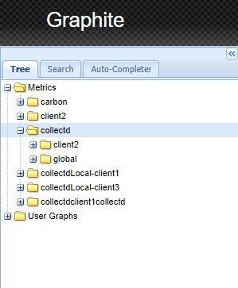
    
    - Thêm variable vào dashboard, click biểu tượng setting dashboard trên menu chọn của dashboar. Click và tab Variables và click Add variable: 

        
    
    - Thêm biến tên host đại diện cho các host collectd client như sau:

        
    
    - Thêm biến metric để đại diện cho các metric mà collectd thu thập: 

        

        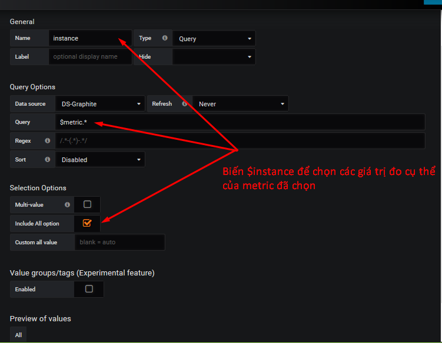

    - Sử dụng các biến vừa tạo: 
    
        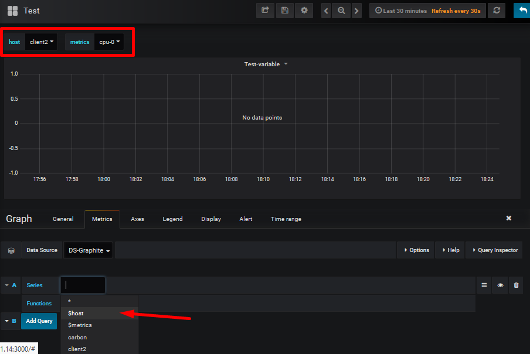

        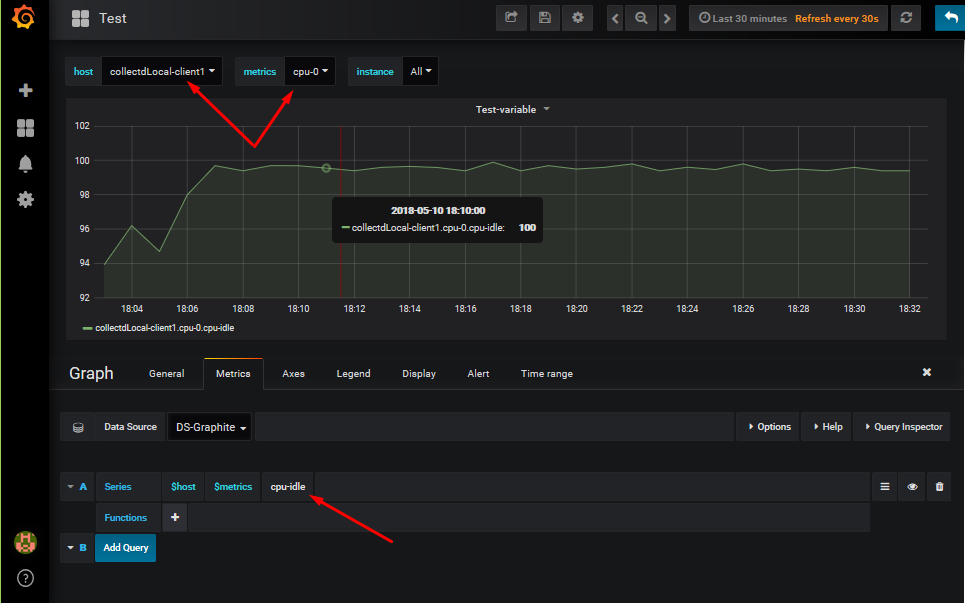

    - Thay đổi biến host để show thông tin cpu-idle của client3 và core cpu-1: 

        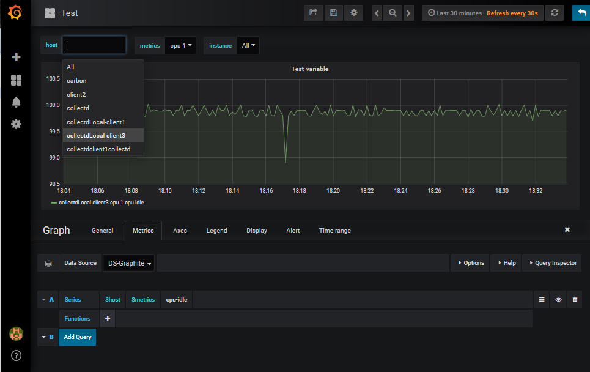

- Các bạn có thể vào link sau để vọc cách sử dụng các biến của Grafana: https://play.grafana.org/d/000000056/graphite-templated-nested?orgId=1  

## 2.	Import Dashboard 

- Một trong những tính năng tuyệt vời nữa của Grafana đó chính là hỗ trợ người dùng import các giao diện dashboard đẹp, sẵn có, đã được cấu hình trước và được chia sẻ miễn phí từ cộng đồng. 

- Đến phiên bản Grafana hiện tại mình đang sử dụng (v5.1.1), việc import dashboard đã được thực hiện thông qua sử dụng ID của dashboard được hỗ trợ chính thức bởi Grafana. 

- Sau đây mình sẽ thực hiện import dashboard dể các bạn dễ hiểu. 

- Data Source sử dụng là Graphite – thu thập metric bởi Collectd. 

- Vào trang chủ của [Grafana](https://grafana.com/), click vào tab Dashboard trên thanh menu chọn trên cùng: 

    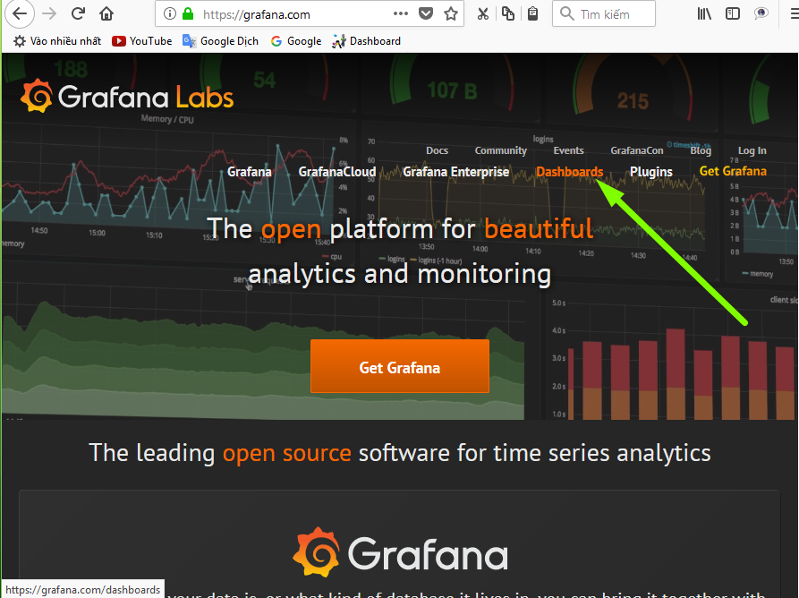

- Trên giao diện tab Dashboard, phía bên trái màn hình sẽ xuất hiện menu lọc để tìm kiếm dashboard một cách nhanh chóng. Điền thông tin vào như sau: 

    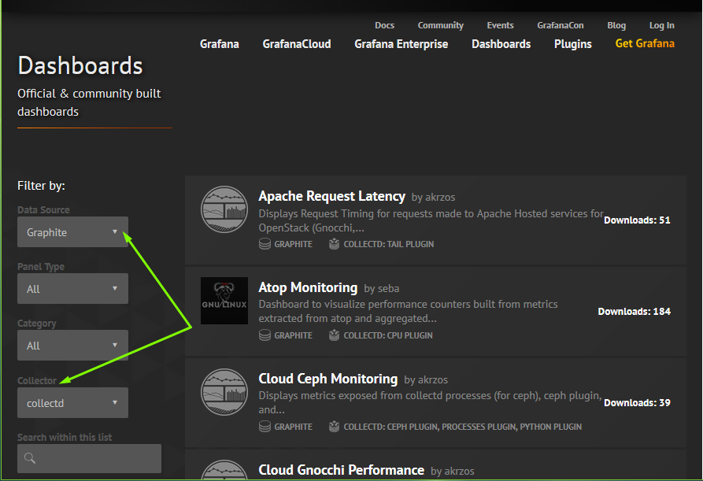

- Từ đó sẽ lọc ra được một số Dashboard cho Graphite-Collectd. Giả sử t chọn Dashboard có tên: CollectD Server Metrics. Click vào dashboard đó :

    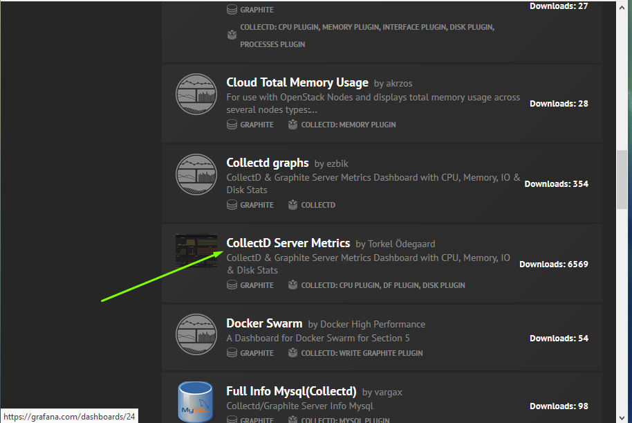

- Thông tin về dashboard vừa chọn hiển thị ra màn hình. Ở đây sẽ tóm tắt một số thông tin về hiển thị metric sẽ gồm những gì và cách cấu hình file collectd.conf để sử dụng dashboard này. Đọc hướng dẫn và cấu hình trên collecd như yêu cầu. 

    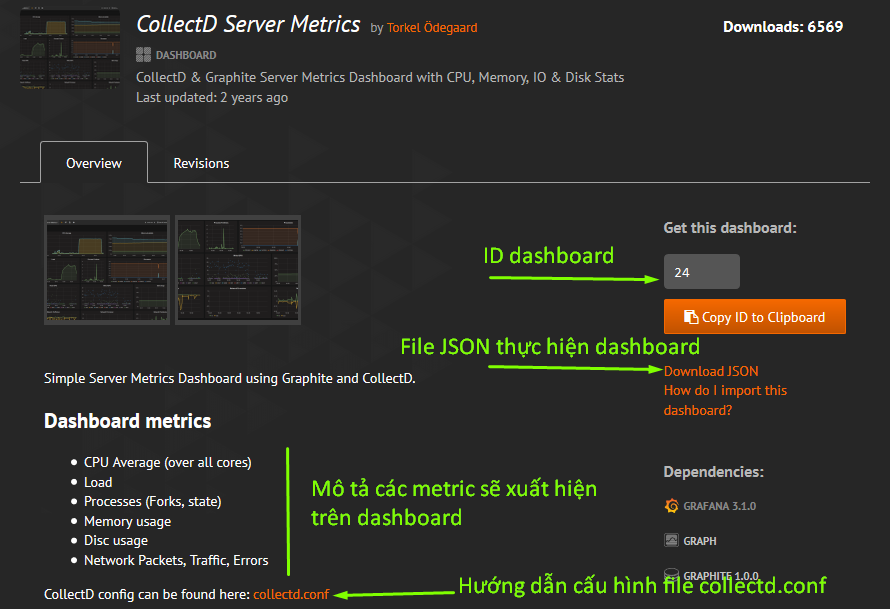

- Có 2 cách thực hiện Import Dashboard là sử dụng ID hoặc sử dụng file JSON. 

    - Nếu chọn sử dụng file JSON thì bạn sẽ có thể tùy chỉnh lại file JSON một chút theo ý mình trước khi import, còn sử dụng ID thì nghiễm nhiên bạn sẽ dùng hoàn toàn như của tác giả. Để đơn giản, ở đây mình sẽ sử dụng ID trước. 

    - Trở lại giao diện Grafana của bạn, tại Home click vào icon Create Dashboard và chọn Import Dashboard 

        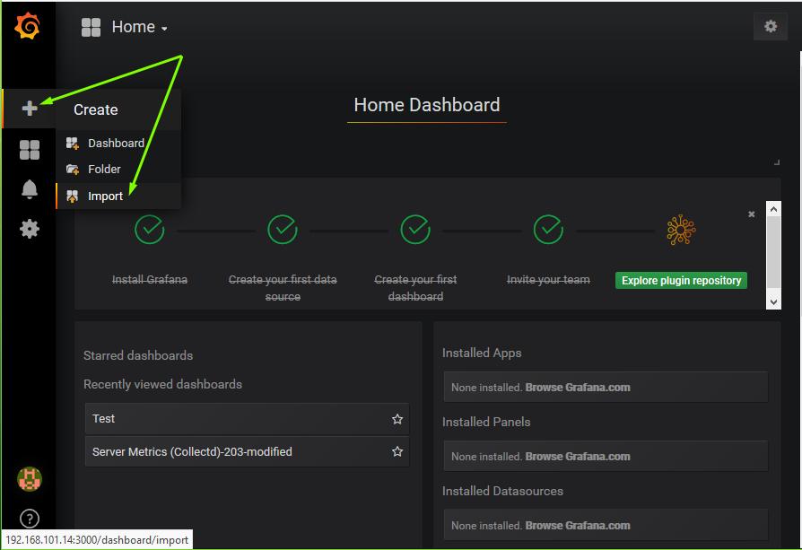
    
    - Giao diện Import xuất hiện các lựa chọn: 

        
        
- Sau khi điền ID của dashboard vào ô trống, Grafana sẽ tự động nhận diện được thông tin vè Dashboard như sau: 

    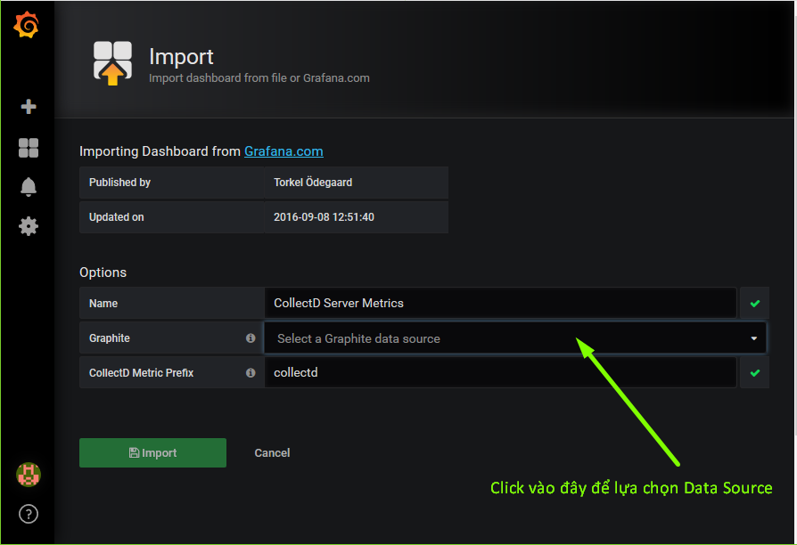

- Giao diện dashboard sẽ hiển thị như sau: 
    
    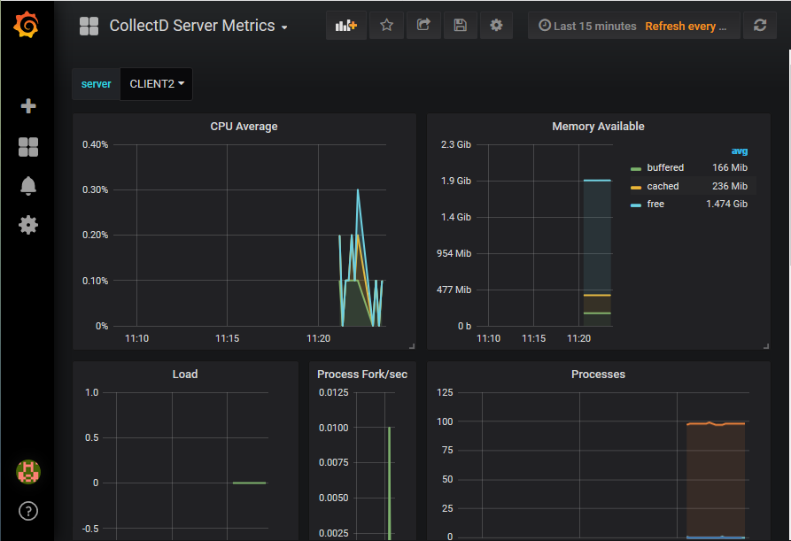

## 3.	Alerting 

- Tính năng cảnh báo của Grafana cũng là một tính năng mà mình cực thích. Nó hơn Graphite ở chỗ có thể thực hiện cấu hình bằng giao diện và hỗ trợ cảnh báo của gmail. Lưu ý, tính năng cảnh báo sẵn có từ phiên bản 4.0 của Grafana. 

- Cảnh báo trong Grafana cho phép gán các rule ngay trong dashboard panel. Khi lưu lại cấu hình dashboard, Grafana sẽ trích xuất các quy tắc cảnh báo thành một lưu trữ cảnh báo tách biệt và lên lịch cho chúng để đánh giá. Tuy nhiên, hiện tại Grafana chỉ hỗ trợ một số Data source: Graphite, Promethus, InfluxDB, OpenTSDB, MySQL, Postgres và Cloudwatch. 

- **Bước 1**: Tạo kênh nhận cảnh báo: 

    - Bên thanh menu chọn bên trái màn hình, click vào biểu tưởng Alert để cấu hình xử lý gửi cảnh báo qua các kênh khi có cảnh báo xảy ra:

        

        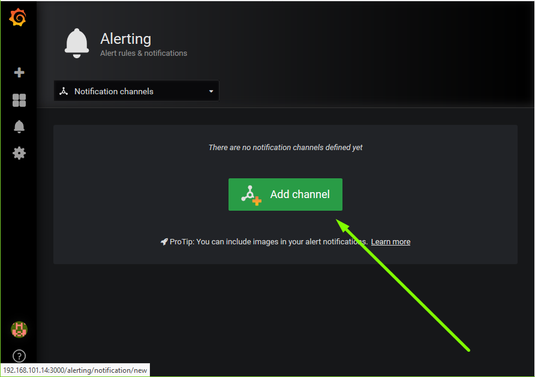

    - Ở đây mình sẽ cấu hình gửi cảnh báo qua gmail:

        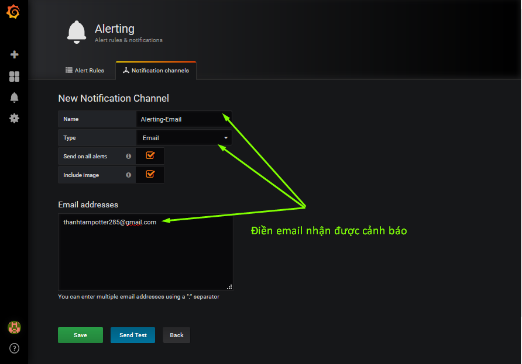

    - Click Save để lưu lại cấu hình. 

    - Để thực hiện gửi được cảnh báo qua gmail, cần cấu hình thông tin SMTP server của gmail trong file cấu hình grafana:       `/etc/grafana/grafana.ini` như sau:

        

        (email nhập ở đây sử dụng để làm email gửi đi cảnh báo, điền password thích hợp email của bạn)

- **Bước 2**: Cấu hình cảnh báo trên các panel:

    - Trong tab Alert của các panel graph, ta có thể cấu hình cảnh báo và cách kích  hoạt cảnh báo.  Cấu hình tại tab Alert Config: 

        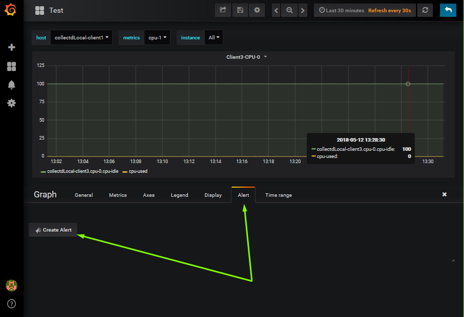

        Ví dụ: Tạo cảnh báo khi phát hiện thấy ngưỡng cpu-idle giảm xuống dưới 20%:

        

    - Giao diện panel sẽ xuất hiện thêm dòng cảnh báo màu hồng icon trái tim. Có thể kéo chuột để thay đổi giá trị cảnh báo. 

    - Cấu hình lựa chọn kênh gửi cảnh báo. Click tab Notification: 
    
        

    - Click vào Save lại dashboard. 

- Thực hiện đẩy CPU với lệnh stress để giảm cpu-idle. Kiểm tra cảnh báo thấy nhận được mail: 

    

## 4. Tham khảo

[1] http://docs.grafana.org/reference/templating/

[2] Grafana Notification Alert: http://docs.grafana.org/alerting/notifications/ 

[3] http://docs.grafana.org/alerting/rules/

[4] http://docs.grafana.org/reference/export_import/