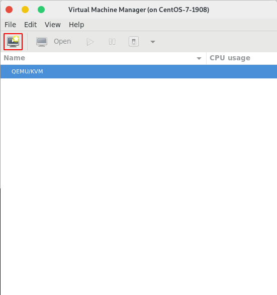

# Create VM Using Virt-Manager
Dưới đây là các bước để tạo VM trong KVM sử dụng virt-manager


## SSH vào máy chủ KVM
Để ssh vào máy chủ KVM ta thực hiện lệnh với cú pháp sau:

```
$ ssh user@kvm-ip
```


**Chú ý:** Để có thể hiển thị được giao diện GTK của virt-manager ta cần ssh với tùy chọn `-X` như sau:
```
$ ssh -X user@kvm-ip
```


## Mở virt-manager
Sau khi ssh vào máy chủ KVM ta cần khởi động virt-manager bằng lệnh `virt-manager`


## Tạo VM mới
Sau đó một giao diện quản lý máy ảo hiện ra cho phép ta tạo, sửa cài đặt, xóa, tạo snapshot, clone .v.v.

Ở giao diện quản lý ta vào `File` -> `New Virtual Machine` hoặc click vào biểu tượng tạo mới VM như sau:



Tiếp theo một màn hình hiện ra cho phép ta chọn phương thức cài đặt VM, ơ đây ta chọn `Local install media (ISO image or CDROM)` để cài đặt từ đĩa hoặc file iso và click vào `Forward` để tiếp tục.


Tiếp theo ta có thể chon đĩa CDROM hoặc DVD để cài đặt nếu có hoặc chọn `Use ISO image` và browse đến file iso đó. Ở đây ta chọn `Use ISO image` và click vào `Browse...` để chọn file iso.


Tiếp theo ta chọn file iso và click vào `Choose Volume` để tiếp tục.


Tiếp theo ta ấn `Forward` để chuyển sang bước tiếp theo.


Ở màn hình tiếp theo cho phép ta chọn dung lượng RAM và CPU, ở đây ta để dung lượng RAM là 512 và CPU là 1 và click `Forward` để tiếp tục.


Tiếp theo ta cần lựa chọn đĩa chính để sử dụng cho VM:
- Nếu ta có một đĩa có sẵn ta có thể sử dụng bằng cách chọn `Select or create custom storage`. Ngoài ra trong tùy chọn này ta cũng có thể tạo một đĩa mới với nhiều tùy chọn hơn như định dạng đĩa, đường dẫn lưu trữ .v.v.
- Nếu ta không có đĩa sẵn ta có thể chọn `Create a disk image for virtual machine` để tạo đĩa mới, tuy nhiên với tùy chọn này ta chỉ có thể xác định dung lượng đĩa, thư mục lưu trữ mặc định sẽ là `/var/lib/libvirt/images/`.

Ở đây ta sẽ tạo đĩa mới bằng cách chọn `Create a disk image for virtual machine` và tùy chọn dung lượng thích hợp sau đó click `Forward` để tiếp tục.


Ở màn hình tiệp theo cho phép ta tùy chọn tên máy và cấu hình network cho VM, ở đây ta đặt tên cho VM và cấu hình network ở chế độ NAT sau đó click `Finish`.


Tiếp theo một màn hình hiện ra quá trình tạo máy ảo.


Sau khi VM được tạo và khởi động sẽ vào giao diện cài đặt như sau, ta tiệp tục thực hiện cài đặt OS.


Cuối cùng sau khi cài đặt thành công, các VM sẽ xuất hiện ở giao diện quản lý, ở đây ta có thể thực hiện các thao tác vơi VM.


