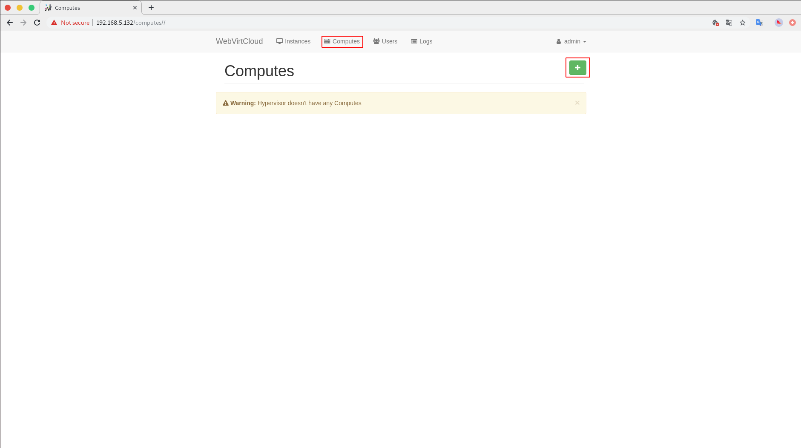
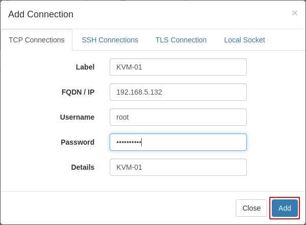
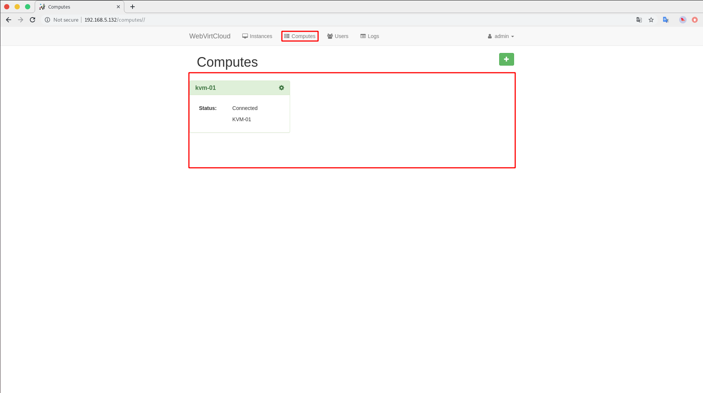
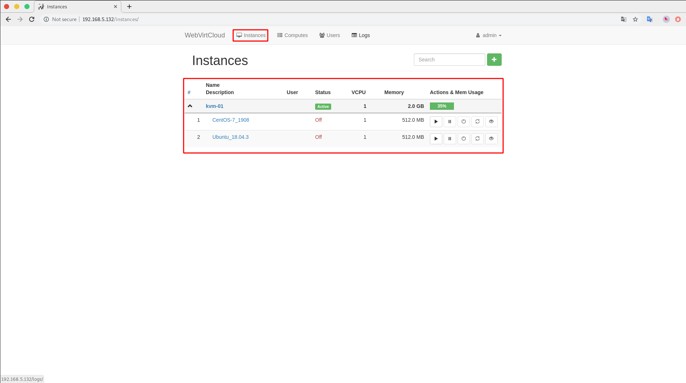

# Install WebVirtCloud


## Cài đặt các gói phụ thuộc
```
$ sudo yum -y install python-virtualenv python-devel libvirt-devel glibc gcc nginx supervisor python-lxml git python-libguestfs iproute-tc
# OR
$ sudo yum -y install python-virtualenv python-devel libvirt-devel glibc gcc nginx supervisor libxml2 libxml2-devel git
```


## Tạo thư mục làm việc và clone repo về
```
sudo mkdir /srv && cd /srv
sudo git clone https://github.com/retspen/webvirtcloud && cd webvirtcloud
cp webvirtcloud/settings.py.template webvirtcloud/settings.py
```

Sau đó ta cần thay đổi `SECRET_KEY` trong file `webvirtcloud/settings.py` bằng một chuỗi bất kỳ đảm bảo nó an toàn, Ví dụ như sau:

```
SECRET_KEY = 'Fc7wlHWguRc6D7Zv'
```

## Cài đặt 
```
$ sudo virtualenv venv
$ sudo source venv/bin/activate
$ sudo venv/bin/pip install --upgrade pip
$ sudo venv/bin/pip install -r conf/requirements.txt
$ sudo cp conf/nginx/webvirtcloud.conf /etc/nginx/conf.d/
$ sudo venv/bin/python manage.py migrate
```


## Cấu hình supervisor
Mở file `/etc/supervisord.conf` và thêm vào cuối file đoạn cấu hình sau đây:

```
[program:webvirtcloud]
command=/srv/webvirtcloud/venv/bin/gunicorn webvirtcloud.wsgi:application -c /srv/webvirtcloud/gunicorn.conf.py
directory=/srv/webvirtcloud
user=nginx`<br />
autostart=true`<br />
autorestart=true`<br />
redirect_stderr=true`<br />

[program:novncd]
command=/srv/webvirtcloud/venv/bin/python /srv/webvirtcloud/console/novncd
directory=/srv/webvirtcloud
user=nginx
autostart=true
autorestart=true
redirect_stderr=true
```


## Sửa cấu hình nginx

Mở file `/etc/nginx/nginx.conf` và comment các dòng cấu hình như sau:

```
#    server {
#        listen       80 default_server;
#        listen       [::]:80 default_server;
#        server_name  _;
#        root         /usr/share/nginx/html;
#
#        # Load configuration files for the default server block.
#        include /etc/nginx/default.d/*.conf;
#
#        location / {
#        }
#
#        error_page 404 /404.html;
#            location = /40x.html {
#        }
#
#        error_page 500 502 503 504 /50x.html;
#            location = /50x.html {
#        }
#    }
```


## Phân quyền

Phân quyền để nginx có thể đọc thư mục webvirtcloud:

```
$ sudo chown -R nginx:nginx /srv/webvirtcloud
```

Thay đổi quyền cho selinux:

```
$ yum install policycoreutils-python -y
$ sudo semanage fcontext -a -t httpd_sys_content_t "/srv/webvirtcloud(/.*)"
```

<!--
## Thêm người dùng cần thiết vào nhóm kvm:

```
$ sudo usermod -G kvm -a webvirtmgr
```
-->


## Cấu hình Firewall
```
$ sudo firewall-cmd --permanent --add-port=80/tcp
$ sudo firewall-cmd --permanent --add-port=6080/tcp
$ sudo firewall-cmd --reload
```


## Enable end start services:

```
$ sudo systemctl enable nginx
$ sudo systemctl enable supervisord
$ sudo systemctl start nginx
$ sudo systemctl start supervisord
```


## Cấu hình trên host cài KVM

**Chú ý:** Các bước sau đây được thực hiện sau khi đã cài đặt KVM.


Chỉnh sửa cấu hình libvirt

```
vi /etc/libvirt/libvirtd.conf
```

Thêm các cấu hình sau vào cuối file:

```
listen_tls = 0
listen_tcp = 1
tcp_port = "16509"
listen_addr = "0.0.0.0"
auth_tcp = "none"  
```

Sau đó chỉnh sửa trên file /etc/sysconfig/libvirtd
```
LIBVIRTD_ARGS="--listen"
```

Kiểm tra lại cài đặt

```
systemctl restart libvirtd
ps ax | grep libvirtd
ss -antup | grep libvirtd
virsh -c qemu+tcp://127.0.0.1/system
```


## Truy cập WebVirtCloud và add các Node KVM
Tiếp theo ta truy cập vào đường dẫn `http://webvirtcloud-ip` để truy cập vào giao diện quản lý của WebVirtCloud, sau đó ta đăng nhập bằng tài khoản và mật khẩu là `admin:admin`.

Ta vào tab `Computers` và click vào dấu `+` để thêm node.



Tiếp theo ta nhập thông tin để  kết nối TCP với node và click `Add` để thêm node.



Cuối cùng ta truy cập vào tab `Comouters` sẽ xuất hiện node mới vừa được add.



Ta chuyển sang tab  `Instances` sẽ có các thông tin về node và các VM trong node như sau:

